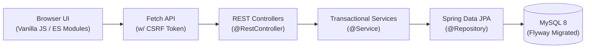

<div align="center">
  
  <h1>Libris: Enterprise Library Management System</h1>
  <p><strong>A modern, responsive, and robust library management platform built with Spring Boot 3.5 and Vanilla ES Modules.</strong></p>

  [](https://github.com/your-username/libris/actions)
  [](https://github.com/your-username/libris)
  [](LICENSE)
  [](https://spring.io/projects/spring-boot)

</div>

---

Libris is a comprehensive Library Management System designed for educational institutions. It features a secure REST API powered by Java 21 and Spring Boot, paired with an elegant, dual-theme frontend (Ember Dark / Verdigris Light) built entirely without heavy SPA frameworks.

## ✨ Key Features

| Feature Area | Description |
|---|---|
| **Secure Identity** | Session-based authentication (BCrypt) + Opt-in **Google OpenID Connect (SSO)**. |
| **Role-Based Access** | Strictly enforced permissions for `ADMIN`, `LIBRARIAN`, and `STUDENT` across controllers and UI. |
| **Complete Cataloging** | Track and manage Books, Magazines, and Newspapers with ISBN validation and availability locks. |
| **Borrowing Workflow** | Automated checkout limits, return history tracking, and overdue analytics. |
| **Modern UX/UI** | Fast, vanilla ES Modules frontend with dynamic shell, custom CSS properties, and responsive design. |
| **Audit & Observability** | Automatic JPA auditing (`created_at` / `updated_at`) and **Structured JSON Logging** for ELK/Datadog. |
| **Production Ready** | Robust Docker Compose setup, Flyway migrations, CSRF protection, and Actuator metrics. |

## 🏗️ Architecture Overview



For an in-depth architectural breakdown, including ADRs and schema definitions, see [`docs/ARCHITECTURE.md`](docs/ARCHITECTURE.md).

## 🚀 Quick Start (Docker)

The recommended way to run Libris locally is via Docker. Ensure you have [Docker](https://docs.docker.com/get-docker/) and [Docker Compose](https://docs.docker.com/compose/install/) installed.

1. **Clone the repository:**
   ```bash
   git clone https://github.com/your-username/libris.git
   cd libris/backend
   ```
2. **Configure Environment:**
   ```bash
   cp .env.example .env
   # Edit .env and set secure values for LMS_DB_PASSWORD and LMS_ADMIN_PASSWORD
   ```
3. **Launch the stack:**
   ```bash
   docker compose up --build
   ```

Navigate to `http://localhost:8080`. Log in using the username `admin` and the password you defined in `.env`.

*Note: To run without Docker using the embedded H2 database, run `./mvnw spring-boot:run -Dspring-boot.run.profiles=h2`.*

## 📸 Screenshots

| Dashboard (Ember Theme) | Catalog (Verdigris Theme) |
|---|---|
| ** | ** |
| **Analytics Overview** | **Student Management** |
| ** | ** |

*(Full evidence in `screenshots/desktop` and `screenshots/mobile`)*

## 📚 Documentation

Dive deeper into the system's technical details:

- [API Contract](docs/API.md): Request/response schemas and error codes.
- [Database Setup](docs/DATABASE.md): ER diagram and migration strategies.
- [Frontend Architecture](docs/FRONTEND.md): Component injection and module boundaries.
- [Security Model](docs/SECURITY.md): CSRF flow, OAuth implementation, and role matrices.
- [Production Readiness](docs/PRODUCTION_READINESS.md): Audit of deployment readiness, logging, and dependency hygiene.
- [Release Notes](docs/RELEASE_NOTES_v1.0.1.md): Latest changes in `v1.0.1`.

## 🤝 Contributing

We welcome contributions! Please see our [Contributing Guidelines](CONTRIBUTING.md) for details on our code of conduct, development environment setup, and the process for submitting Pull Requests.

To run the test suite locally:
```bash
./mvnw clean verify
```

## 📄 License

This project is licensed under the MIT License - see the [LICENSE](LICENSE) file for details.
