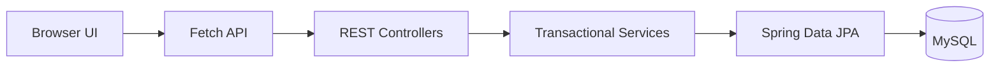

# Library Management System

A responsive Library Management System built with Spring Boot, MySQL, and a vanilla HTML/CSS/JavaScript frontend. It is a single deployable application: the browser client is served by Spring Boot and communicates with the REST API through Fetch. Docker Compose is the recommended way to run it.

## Features

- Session-based authentication with Spring Security and BCrypt passwords.
- Role-based authorization for administrators and librarians.
- Books, students, and librarians CRUD operations.
- Borrow and return workflow with availability protection and preserved history.
- Dashboard totals and a safe current-user profile view.
- Responsive desktop and mobile interface.
- Server-side validation with field-level frontend feedback.
- MockMvc integration tests, including the real browser CSRF cookie/header flow.
- Repository tests for ISBN uniqueness and auditing timestamps.

## Technology Stack

Java 21, Spring Boot 3.5, Spring Security 6.5, Spring Data JPA, Hibernate, MySQL, HTML, CSS, JavaScript, Fetch API, Maven, JUnit 5, MockMvc, and H2 for isolated tests.

## Project Architecture

```text
Browser -> Fetch API -> REST Controller -> Service -> Repository -> MySQL
```



The complete architecture, ADRs, database design, API conventions, and frozen decisions are in [docs/ARCHITECTURE.md](docs/ARCHITECTURE.md).

## Folder Structure

```text
.
├── backend/       Spring Boot application, frontend assets, and tests
├── docs/          Architecture, API, setup, testing, and release documents
├── screenshots/   Desktop and mobile review evidence
└── README.md      Project entry point
```

See [docs/PROJECT_STRUCTURE.md](docs/PROJECT_STRUCTURE.md) for the detailed map.

## API Overview

The API is rooted at `/api` and uses structured JSON responses. Main resources are:

- `/api/auth` — CSRF bootstrap, login, logout, and current session.
- `/api/books` — searchable book catalogue and CRUD operations.
- `/api/students` and `/api/librarians` — profile management.
- `/api/borrow-records` — borrow, return, and history.
- `/api/dashboard` and `/api/profile` — authenticated user views.

See [docs/API.md](docs/API.md) for endpoint, role, status, and error details.

## Docker Quick Start (Recommended)

Prerequisites: [Docker](https://docs.docker.com/get-docker/) and [Docker Compose](https://docs.docker.com/compose/install/).

```bash
cd backend
cp .env.example .env
# Edit .env and set passwords, then:
docker compose up --build
```

Open <http://localhost:8080>. The admin seed is configured via `LMS_ADMIN_PASSWORD` in `.env`.

Once running, explore the API at <http://localhost:8080/swagger-ui/index.html>.

To include phpMyAdmin (on port 8081), use:

```bash
docker compose --profile dev up --build
```

## Running Locally (Without Docker)

Prerequisites: Java 21+, MySQL, and a database account that can create/use `librarydb`.

```bash
export LMS_DB_USERNAME=your_mysql_user
export LMS_DB_PASSWORD=your_mysql_password
./mvnw spring-boot:run
```

Open <http://localhost:8080>. The local development seed is `admin` / `ChangeMe123!`; change it before any non-local deployment.

Detailed configuration is in [docs/SETUP.md](docs/SETUP.md).

## Testing

Run the full isolated test suite from the repository root:

```bash
./mvnw clean test
```

Tests use H2 in MySQL compatibility mode and include authentication, role restrictions, CRUD, borrow/return, validation, ISBN conflicts, CSRF cookie/header exchange, and repository safeguards. See [docs/TESTING.md](docs/TESTING.md).

## Screenshots

Desktop evidence is maintained in [screenshots/desktop](screenshots/desktop):

- [Login](screenshots/desktop/authentication.png)
- [Dashboard](screenshots/desktop/dashboard.png)
- [Books](screenshots/desktop/books.png)
- [Students](screenshots/desktop/students.png)
- [Librarians](screenshots/desktop/librarians.png)
- [Borrow records](screenshots/desktop/borrow_records.png)
- [Duplicate username](screenshots/desktop/duplicate_username.png)
- [Validation](screenshots/desktop/invalid_details.png)
- [Borrow workflow](screenshots/desktop/record_a_borrow.png)

Mobile evidence is maintained in [screenshots/mobile](screenshots/mobile):

- [Dashboard](screenshots/mobile/mobile_dashboard.png)
- [Authentication and navigation](screenshots/mobile/mobile_authentication.png)
- [Duplicate ISBN](screenshots/mobile/mobile_duplicate_isbn.png)
- [Validation](screenshots/mobile/mobile_validation_failed.png)
- [Borrow/return](screenshots/mobile/mobile_borrow_returned.png)

## Future Improvements

Reservations, fines, notifications, physical-copy modelling, and JWT-based API access are intentionally deferred from v1.0.0.

## Documentation

- [Architecture](docs/ARCHITECTURE.md)
- [API contract](docs/API.md)
- [Requirements](docs/REQUIREMENTS.md)
- [Setup](docs/SETUP.md)
- [Testing](docs/TESTING.md)
- [Changelog](docs/CHANGELOG.md)
