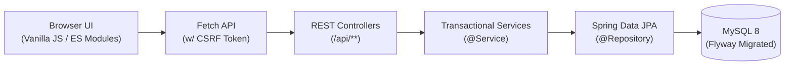

<div align="center">
  
  <h1>Libris — Library Management System</h1>
  <p><strong>A modern, responsive, and robust library management platform built with Spring Boot 3.5 and Vanilla ES Modules.</strong></p>

  [](https://github.com/prathamkashyap/library-management-system/actions)
  [](https://github.com/prathamkashyap/library-management-system)
  [](LICENSE)
  [](https://spring.io/projects/spring-boot)
  [](https://openjdk.org/projects/jdk/21/)

</div>

---

Libris is a comprehensive Library Management System designed for educational institutions. It features a secure REST API powered by Java 21 and Spring Boot, paired with an elegant, dual-theme frontend (Ember Dark / Verdigris Light) built entirely without heavy SPA frameworks.

## ✨ Key Features

| Feature Area | Description |
|---|---|
| **Secure Identity** | Session-based authentication (BCrypt) + Opt-in **Google OpenID Connect (SSO)**. |
| **Role-Based Access** | Strictly enforced permissions for `ADMIN`, `LIBRARIAN`, and `STUDENT` across all endpoints. |
| **Complete Cataloging** | Track Books, Magazines, and Newspapers with ISBN validation, book categories/genres, and availability locks. |
| **Borrowing Workflow** | Automated checkout, 14-day due date defaults, real-time overdue tracking, and return history. |
| **Interactive API Docs** | Auto-generated **Swagger UI** at `/swagger-ui.html` (OpenAPI 3.0) — browse and test all endpoints live. |
| **Analytics & Reports** | Dashboard analytics, CSV exports (inventory and borrowing history with due dates). |
| **Modern UX/UI** | Fast, vanilla ES Modules frontend with dynamic shell, command palette, custom CSS themes, and responsive design. |
| **Audit & Observability** | JPA auditing (`created_at`/`updated_at`), **Structured JSON Logging** for ELK/Datadog, Actuator health/metrics. |
| **Production Ready** | Docker Compose, Flyway versioned migrations, CSRF protection, Railway/Render 1-click deployment configs. |

## 🏗️ Architecture Overview



## 🚀 Quick Start

### Option A — Docker Compose (Local)

```bash
git clone https://github.com/prathamkashyap/library-management-system.git
cd library-management-system/backend
cp .env.example .env
# Edit .env: set LMS_DB_PASSWORD and LMS_ADMIN_PASSWORD
docker compose up --build
```

Navigate to <http://localhost:8080>. Log in with `admin` / your `LMS_ADMIN_PASSWORD`.  
Swagger UI: <http://localhost:8080/swagger-ui.html>

### Option B — H2 In-Memory (No Docker)

```bash
export LMS_ADMIN_PASSWORD=ChangeMe123!
./mvnw spring-boot:run -Dspring-boot.run.profiles=h2
```

### Option C — Deploy to Railway (Recommended)

1. Go to [railway.app](https://railway.app) → **New Project** → **Deploy from GitHub repo** → select this repo.
2. Add a **MySQL** database plugin.
3. Set env vars: `LMS_DB_URL`, `LMS_DB_USERNAME`, `LMS_DB_PASSWORD`, `LMS_ADMIN_PASSWORD`, `SPRING_PROFILES_ACTIVE=docker`.
4. Railway auto-detects `railway.json` and the multi-stage `Dockerfile`.

See [docs/DEPLOYMENT.md](docs/DEPLOYMENT.md) for Render, Fly.io, and Hugging Face Spaces guides.

## 📋 API Documentation

| Endpoint | Description |
|---|---|
| `/swagger-ui.html` | Interactive Swagger UI (try any endpoint live — no login required) |
| `/v3/api-docs` | Raw OpenAPI 3.0 JSON spec |
| `/actuator/health` | Health check probe |

## 🧪 Running Tests

```bash
./mvnw clean verify
```

- **35 tests** across 6 test classes (integration, CSRF flow, hardening, architecture, repository, unit)
- H2 in-memory — no MySQL or extra env vars needed
- JaCoCo enforces **≥ 70% line coverage**
- Spotless enforces **Google Java Format**

## 📚 Documentation

| Doc | Contents |
|---|---|
| [API.md](docs/API.md) | All endpoints, request/response shapes, error codes |
| [DATABASE.md](docs/DATABASE.md) | ER diagram, table schemas, Flyway migration log |
| [SECURITY.md](docs/SECURITY.md) | CSRF, session, OAuth2 OIDC, role matrix |
| [DEPLOYMENT.md](docs/DEPLOYMENT.md) | Railway, Render, Fly.io, Hugging Face, Docker Compose |
| [FRONTEND.md](docs/FRONTEND.md) | ES module architecture, component injection, theming |
| [CURRENT_STATE.md](docs/CURRENT_STATE.md) | Live test counts, coverage, feature inventory |

## 📄 License

This project is licensed under the MIT License — see the [LICENSE](LICENSE) file for details.
