# Library Management System

A responsive Library Management System built with Spring Boot 3.5, MySQL, and a vanilla HTML/CSS/JavaScript frontend. The browser client is served by Spring Boot and communicates with the REST API through the Fetch API. Docker Compose is the recommended way to run it.

## Features

- **Session-based authentication** with Spring Security and BCrypt password hashing.
- **Role-based authorization** for administrators, librarians, and students (three roles enforced via URL-pattern matching).
- **Books, magazines, and newspapers** CRUD with searchable catalogues.
- **Student and librarian management** with linked account creation and profile maintenance.
- **Borrow and return workflow** with availability protection, ISBN uniqueness enforcement, and preserved history.
- **Dashboard statistics** — aggregate counts of students, librarians, books, borrowed, and available.
- **Audit logging** — server-side event tracking with `created_at` / `updated_at` timestamps on all entities.
- **Responsive desktop and mobile interface** built with CSS custom properties and mobile-first breakpoints.
- **Server-side validation** with field-level frontend feedback and a uniform `ApiErrorResponse` JSON shape.
- **MockMvc integration tests**, including a browser-equivalent CSRF cookie/header flow test.
- **Repository tests** for ISBN uniqueness constraint and auditing timestamp population.
- **Spring Boot Actuator** with health, info, and metrics endpoints for production monitoring.
- **Structured JSON logging** via Logstash encoder with traceId/spanId MDC support.
- **Spotless formatting** enforced in CI with Google Java Format.
- **Dual-theme system** with a cool dark blue theme and a rosy pink theme, switchable from Settings.
- **Smooth theme transitions** with CSS animations and no flash on page load.
- **Decorative floating elements** — rose petals in pink mode, cosmic particles in blue mode.

## Technology Stack

| Layer | Technology |
|-------|------------|
| Language | Java 21 |
| Framework | Spring Boot 3.5, Spring Security 6.5, Spring Data JPA |
| Database | MySQL 8 (production), H2 in MySQL-compatibility mode (tests) |
| Frontend | Vanilla HTML, CSS (custom properties), JavaScript (ES modules), Fetch API |
| Build | Maven, Maven Wrapper |
| Testing | JUnit 5, MockMvc, Hamcrest, AssertJ |
| Containerization | Docker, Docker Compose |
| CI | GitHub Actions (`mvn spotless:check` + `mvn clean verify`) |

## Architecture

```text
Browser → Fetch API → REST Controllers → Transactional Services → Spring Data JPA → MySQL
```

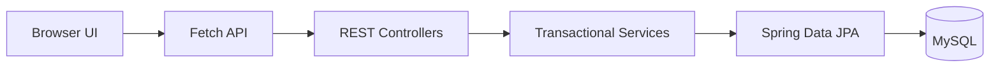

The frontend is a multi-page application served as static resources from Spring Boot. Each page is a standalone HTML file with its own JavaScript module. Roles are enforced at the URL-pattern level in `SecurityConfig` — no method-level annotations.

See [docs/ARCHITECTURE.md](docs/ARCHITECTURE.md) for the complete system design, ADRs, and database schema.

## Project Structure

```text
.
├── backend/          Spring Boot application, frontend assets, and tests
│   ├── src/main/java/com/example/lms/
│   │   ├── config/           PasswordConfig, AdminSeeder, OpenApiConfig
│   │   ├── controller/       14 REST controllers
│   │   ├── dto/              24 request/response records
│   │   ├── entity/           8 entities + 1 superclass + 3 enums
│   │   ├── exception/        3 custom exceptions + global handler
│   │   ├── repository/       8 JPA repositories
│   │   ├── security/         5 security classes
│   │   └── service/          11 transactional services
│   ├── src/main/resources/
│   │   ├── static/           Frontend (HTML, JS, CSS, assets)
│   │   └── application.properties
│   └── src/test/             Integration and repository tests
├── docs/             Architecture, API, setup, testing, and release documents
├── screenshots/      Desktop and mobile review evidence
└── README.md         This file
```

See [docs/ARCHITECTURE.md](docs/ARCHITECTURE.md#35-package-structure) for the full package map.

## Roles and Permissions

| Role | Books (GET) | Books (mutate) | Students | Librarians | Borrow Records | Dashboard |
|------|:-----------:|:--------------:|:--------:|:----------:|:--------------:|:---------:|
| **ADMIN** | ✅ | ✅ | ✅ | ✅ | ✅ | ✅ |
| **LIBRARIAN** | ✅ | ✅ | ✅ | ❌ | ✅ | ✅ |
| **STUDENT** | ✅ | ❌ | ❌ | ❌ | ❌ | ❌ |

All other endpoints (profile, auth) follow standard authenticated-user rules. See [docs/SECURITY.md](docs/SECURITY.md) for the complete authorization model.

## API Overview

The REST API is rooted at `/api` and returns structured JSON. Key resource groups:

| Endpoint Group | Purpose |
|----------------|---------|
| `/api/auth` | CSRF bootstrap, login, logout, current session |
| `/api/books` | Searchable book catalogue and CRUD |
| `/api/magazines` | Magazine catalogue and CRUD |
| `/api/newspapers` | Newspaper catalogue and CRUD |
| `/api/students` | Student profile management |
| `/api/librarians` | Librarian profile management (ADMIN only) |
| `/api/borrow-records` | Borrow, return, and history |
| `/api/dashboard` | Aggregate statistics |
| `/api/profile` | Current authenticated user view |
| `/actuator` | Health, info, and metrics (production monitoring) |

See [docs/API.md](docs/API.md) for the complete endpoint catalogue, request/response schemas, and error codes.

## Quick Start

### Docker (Recommended)

Prerequisites: [Docker](https://docs.docker.com/get-docker/) and [Docker Compose](https://docs.docker.com/compose/install/).

```bash
cd backend
cp .env.example .env
# Edit .env — set LMS_DB_PASSWORD and LMS_ADMIN_PASSWORD
docker compose up --build
```

Open <http://localhost:8080>. The admin credentials are configured via `LMS_ADMIN_PASSWORD` in `.env`.

To include phpMyAdmin (port 8081):

```bash
docker compose --profile dev up --build
```

### Local Development

Prerequisites: Java 21+, MySQL, and a database account that can create/use `librarydb`.

```bash
export LMS_DB_USERNAME=your_mysql_user
export LMS_DB_PASSWORD=your_mysql_password
export LMS_ADMIN_PASSWORD=your_admin_password   # required
./mvnw spring-boot:run -Dspring-boot.run.profiles=h2
```

For MySQL instead of H2, omit the profile flag and ensure the MySQL instance is running:

```bash
export LMS_DB_USERNAME=root
export LMS_DB_PASSWORD=secret
export LMS_ADMIN_PASSWORD=ChangeMe123!
./mvnw spring-boot:run
```

Open <http://localhost:8080>. See [docs/SETUP.md](docs/SETUP.md) for full configuration details.

### Swagger UI

Once running, explore the API interactively at <http://localhost:8080/swagger-ui/index.html>.

## Testing

Run the full isolated test suite from the repository root:

```bash
./mvnw clean test
```

Tests use H2 in MySQL compatibility mode (`create-drop` schema strategy) and cover authentication, role restrictions, CRUD, borrow/return lifecycle, validation errors, ISBN conflicts, CSRF cookie/header exchange, repository safeguards, and full Student/Librarian delete with account cleanup.

| Test File | Type | Methods | Coverage |
|-----------|------|---------|----------|
| `LibraryManagementIntegrationTest` | Integration (MockMvc) | 4 | Login, full CRUD + borrow/return, validation, ISBN conflicts, 401/403 |
| `CrudIntegrationTest` | Integration (MockMvc) | 7 | Magazine/Newspaper CRUD, Student/Librarian update+delete, Dashboard, Audit, duplicate username |
| `BrowserCsrfFlowIntegrationTest` | Integration (real CSRF flow) | 1 | CSRF bootstrap → login → session reuse → logout → post-logout rejection |
| `BookRepositoryTest` | Repository | 1 | Audit timestamp population, ISBN uniqueness constraint |

See [docs/TESTING.md](docs/TESTING.md) for the complete test inventory and coverage gaps.

## Screenshots

### Desktop

| | |
|---|---|
| 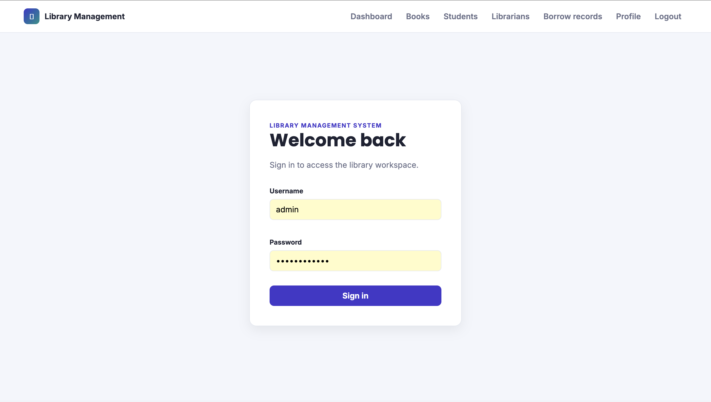 | 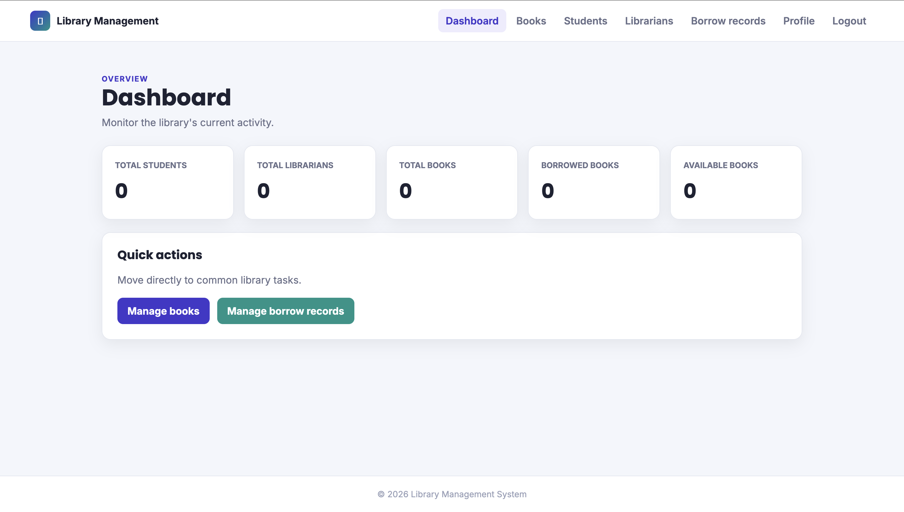 |
| 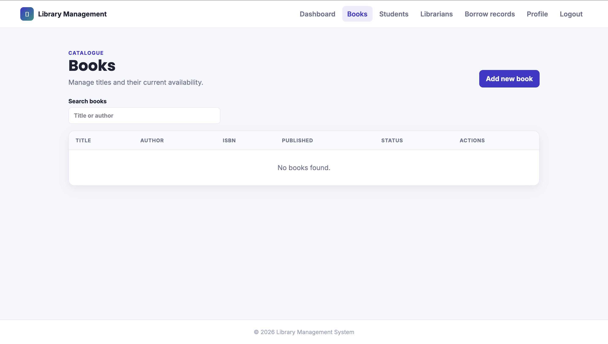 | 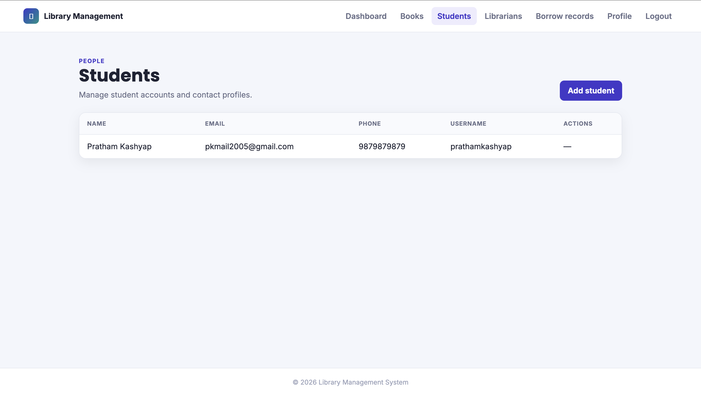 |
| 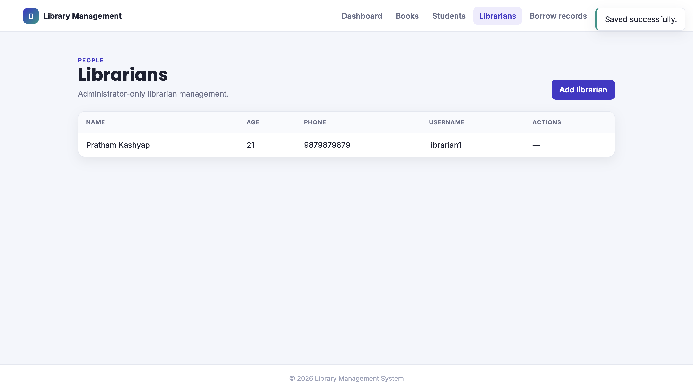 | 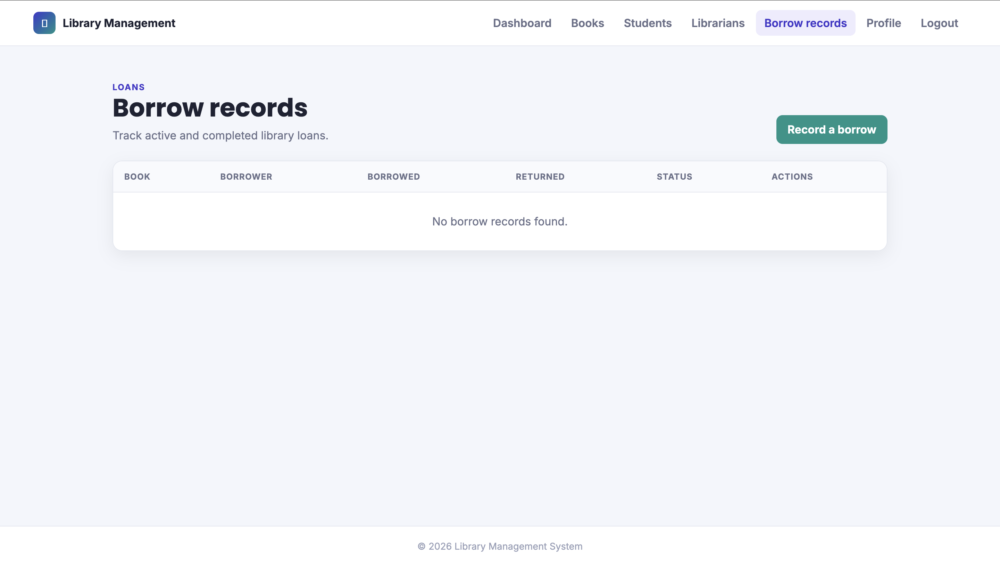 |
| 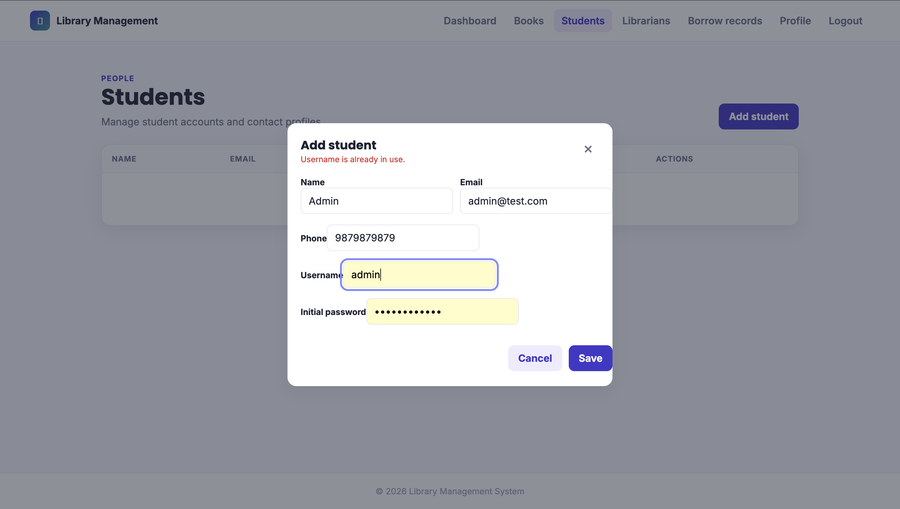 | 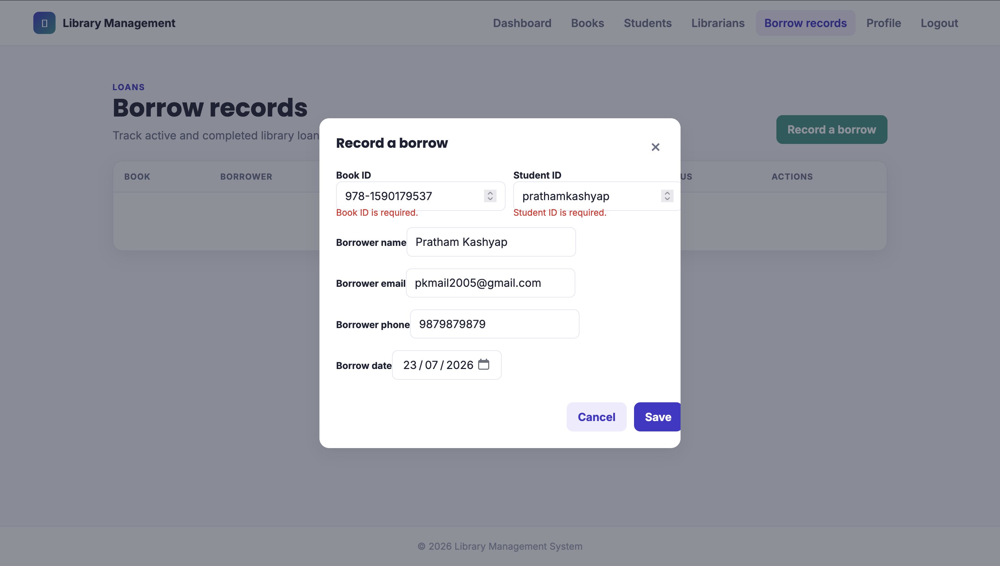 |

### Mobile

| | |
|---|---|
| 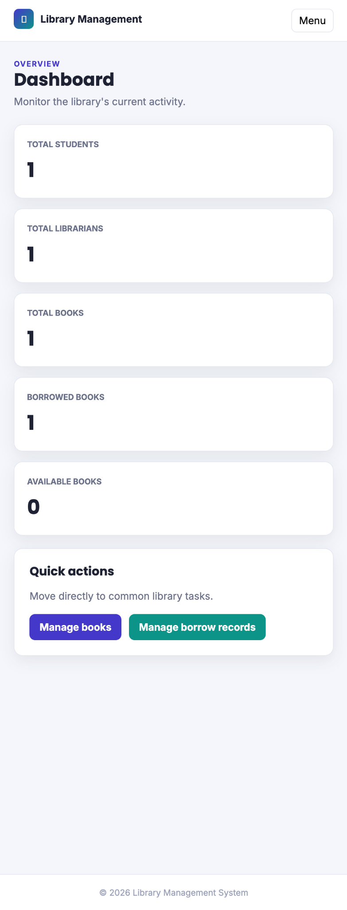 | 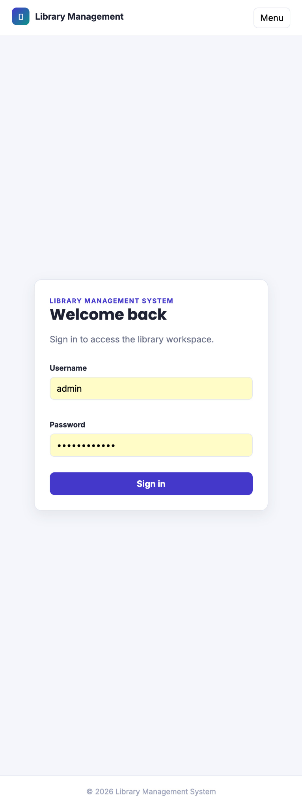 |
| 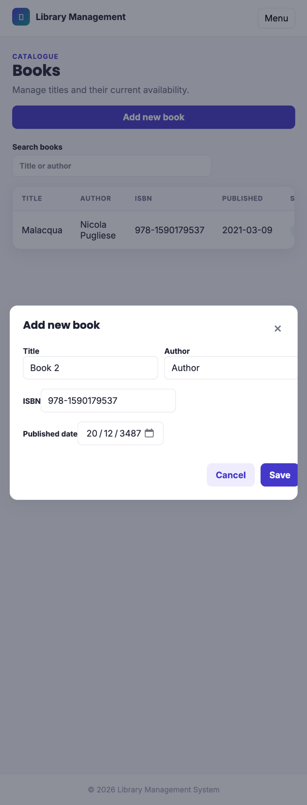 | 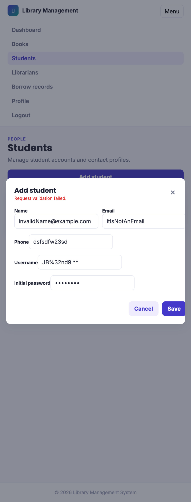 |

Full evidence in [screenshots/desktop](screenshots/desktop) and [screenshots/mobile](screenshots/mobile).

## Documentation

| Document | Description |
|----------|-------------|
| [Architecture](docs/ARCHITECTURE.md) | System design, layering, ADRs, database schema, and endpoint catalogue |
| [API Contract](docs/API.md) | REST endpoint reference with request/response schemas and error codes |
| [Database](docs/DATABASE.md) | ER diagram, table definitions, relationships, and schema notes |
| [Frontend](docs/FRONTEND.md) | MPA structure, JavaScript modules, CSS architecture, and CSRF flow |
| [Security](docs/SECURITY.md) | Authentication, authorization, CSRF protection, and session management |
| [Setup](docs/SETUP.md) | Local and Docker configuration, environment variables, and troubleshooting |
| [Testing](docs/TESTING.md) | Test inventory, how to run, coverage gaps, and CI integration |
| [Deployment](docs/DEPLOYMENT.md) | Docker production guide, environment variables, and health checks |
| [Changelog](docs/CHANGELOG.md) | Versioned release history |

## Future Improvements

- **Theme toggle accessibility** — Add theme switcher to sidebar or topbar for quick access from any page.
- **Additional themes** — Consider adding a light blue or system-preference-following theme.
- Reservations, fines, notifications, physical-copy modelling, self-service student registration, and JWT-based API access are intentionally deferred from v1.0.0. See [docs/ARCHITECTURE.md](docs/ARCHITECTURE.md#12-out-of-scope-for-v100) for the full deferred scope.

## License

This project is for educational purposes.
