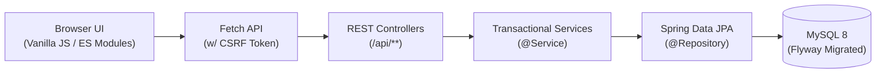
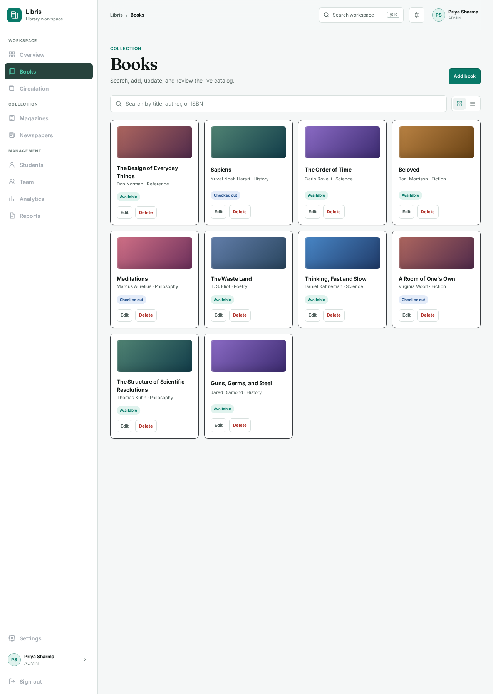
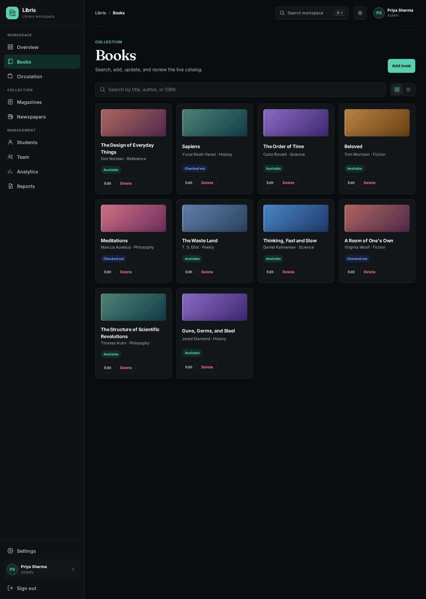
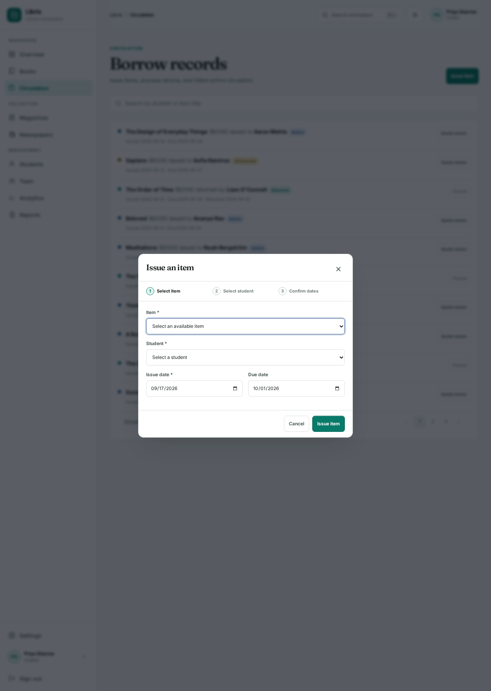
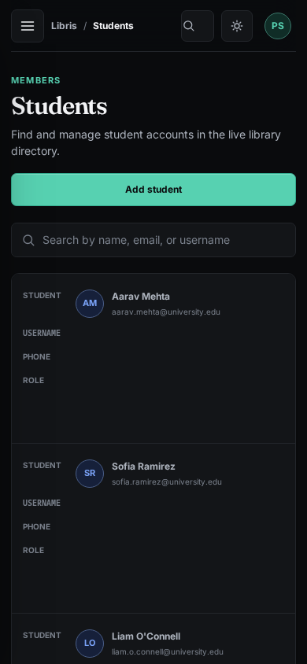

<div align="center">

  

  # 📚 Libris — Library Management System

  **A modern, responsive, and robust library management platform built with Spring Boot 3.5 and Vanilla ES Modules.**

  [](https://github.com/prathamkashyap/libris/actions)
  [](https://github.com/prathamkashyap/libris)
  [](LICENSE)
  [](https://spring.io/projects/spring-boot)
  [](https://openjdk.org/projects/jdk/21/)

</div>

---

## ✨ Overview

Libris is a comprehensive Library Management System designed for educational institutions. It features a secure REST API powered by Java 21 and Spring Boot, paired with an elegant, dual-theme frontend (Ember Dark / Verdigris Light) built entirely without heavy SPA frameworks.

### 🎯 Key Highlights

- **🔐 Secure Identity** — Session-based authentication (BCrypt) + Opt-in Google OpenID Connect (SSO)
- **👥 Role-Based Access** — Strictly enforced permissions for `ADMIN`, `LIBRARIAN`, and `STUDENT`
- **📚 Complete Cataloging** — Track Books, Magazines, and Newspapers with ISBN validation and availability locks
- **🔄 Borrowing Workflow** — Automated checkout, due date management, real-time overdue tracking, and return history
- **📊 Analytics & Reports** — Dashboard analytics, CSV exports, and overdue monitoring
- **🎨 Modern UX/UI** — Fast, vanilla ES Modules frontend with dynamic shell, command palette, and responsive design
- **📝 Audit & Observability** — JPA auditing, structured JSON logging, and Actuator health/metrics
- **🚀 Production Ready** — Docker Compose, Flyway migrations, CSRF protection, and cloud deployment configs

---

## 🏗️ Architecture


```mermaid
flowchart LR
    Browser["Browser UI<br/>(Vanilla JS / ES Modules)"] --> Fetch["Fetch API<br/>(w/ CSRF Token)"]
    Fetch --> Controller["REST Controllers<br/>(/api/**)"]
    Controller --> Service["Transactional Services<br/>(@Service)"]
    Service --> Repository["Spring Data JPA<br/>(@Repository)"]
    Repository --> Database[("MySQL 8<br/>(Flyway Migrated)")]
```

### Technology Stack

| Layer | Technology |
|-------|------------|
| **Backend** | Java 21, Spring Boot 3.5, Spring Security 6.5 |
| **Database** | MySQL 8 (production), H2 (tests/dev) |
| **Frontend** | Vanilla ES Modules, HTML5, CSS3 |
| **Build** | Maven, Docker Compose |
| **CI/CD** | GitHub Actions |
| **Schema** | Flyway migrations (V1–V5) |

---

## 🖼️ Interface

| Verdigris Light | Ember Dark |
|---|---|
|  |  |

| Circulation | Mobile |
|---|---|
|  |  |

Dual-theme shell, command palette and a 3-step circulation wizard, built from
vanilla ES modules. Current captures live in [`screenshots/desktop/`](screenshots/desktop)
and [`screenshots/mobile/`](screenshots/mobile); the pre-redesign interface is retained
separately as historical evidence in [`screenshots/legacy/`](screenshots/legacy).

---

## 🚀 Quick Start

### Option A — Docker Compose (Recommended)

```bash
git clone https://github.com/prathamkashyap/libris.git
cd libris
cp .env.example .env
# Edit .env and set LMS_DB_ROOT_PASSWORD, LMS_DB_PASSWORD and LMS_ADMIN_PASSWORD
docker compose up -d --build
```

Navigate to <http://127.0.0.1:8080>. Log in with `LMS_ADMIN_USERNAME` / `LMS_ADMIN_PASSWORD`.

> The compose stack runs with `SPRING_PROFILES_ACTIVE=prod`, which sets
> `Secure` session cookies. Logging in therefore requires HTTPS. Use this for a
> local smoke test of the health endpoint; for a usable login put a TLS
> reverse proxy in front, as in [docs/DEPLOYMENT.md](docs/DEPLOYMENT.md) §8.

### Option B — H2 In-Memory (No Docker)

```bash
export LMS_ADMIN_PASSWORD=YourStrongPassword123!
./mvnw spring-boot:run -Dspring-boot.run.profiles=h2
```

### Option C — Deploy to Oracle Cloud Infrastructure (Production)

1. Provision an OCI Compute instance (Oracle Linux or Ubuntu)
2. Copy the repository, then:

   ```bash
   cp .env.example .env && $EDITOR .env   # set the three required secrets
   docker compose up -d --build
   ```

Runs MySQL and the application on one Compute instance, published on loopback
behind a host reverse proxy. See [docs/DEPLOYMENT.md](docs/DEPLOYMENT.md) for
build, TLS, health checks, backups and troubleshooting.

---

## 🧪 Testing

```bash
./mvnw clean verify
```

### Test Coverage

- **175 executed tests** across 17 test classes
- **175 `@Test` methods** declared — no skips
- **H2 in-memory** — no MySQL or extra env vars needed
- **JaCoCo** enforces ≥ 70% line coverage (90.3% on the last verified run)
- **Spotless** enforces Google Java Format

### Test Categories

| Category | Tests | Coverage |
|----------|-------|----------|
| Integration (MockMvc) | 25 | Login, CRUD, borrow/return, validation, role checks |
| Service Unit | 89 | Business logic, audit events, pagination |
| Security & Hardening | 37 | Access control, audit events, business-rule guards |
| Concurrency | 9 | Pessimistic locking, race conditions, cache eviction |
| Query Optimization | 12 | SQL-level overdue semantics, keyset pagination |
| Repository | 2 | Constraints, Flyway migration verification |
| Architecture | 1 | Layered architecture validation |
| **Total** | **175** | 17 test classes |

---

## 📚 API Documentation

| Endpoint | Description |
|----------|-------------|
| `/swagger-ui.html` | Interactive Swagger UI (when SpringDoc is enabled) |
| `/v3/api-docs` | Raw OpenAPI 3.0 JSON (when SpringDoc is enabled) |
| `/actuator/health` | Public health check probe |

---

## 📚 Documentation

| Document | Description |
|----------|-------------|
| [API.md](docs/API.md) | All endpoints, request/response shapes, error codes |
| [DATABASE.md](docs/DATABASE.md) | ER diagram, table schemas, Flyway migration log |
| [SECURITY.md](docs/SECURITY.md) | CSRF, session, OAuth2 OIDC, role matrix |
| [DEPLOYMENT.md](docs/DEPLOYMENT.md) | Oracle Cloud Infrastructure: build, environment, TLS, health checks, backups |
| [FRONTEND.md](docs/FRONTEND.md) | ES module architecture, component injection, theming |
| [CURRENT_STATE.md](docs/CURRENT_STATE.md) | Current release, test inventory, deployment state |
| [ARCHITECTURE.md](docs/ARCHITECTURE.md) | System architecture, data flow, REST API design |
| [TESTING.md](docs/TESTING.md) | Test inventory, test infrastructure, CI integration |
| [SETUP.md](docs/SETUP.md) | Local development setup, environment variables |

---

## 🔒 Security Features

- **BCrypt** password hashing
- **Session-based** authentication with CSRF protection
- **Role-based** URL-pattern authorization
- **Failed login** audit events
- **Operational logging** for security-relevant events
- **Pessimistic locking** for borrow/return race protection
- **No credential leakage** in logs or audit events

---

## 🎨 Frontend Features

- **Dual-theme** design (Ember Dark / Verdigris Light)
- **Responsive** layout for desktop and mobile
- **Dynamic shell** with sidebar and command palette
- **Modal components** for forms
- **Toast notifications** for user feedback
- **ES module** architecture for maintainability

---

## 📈 Recent Enhancements (v1.1.0)

### Concurrency & Performance
- ✅ Pessimistic locking for borrow/return race protection
- ✅ Cache eviction on circulation changes
- ✅ N+1 query prevention via EntityGraph
- ✅ V5 database indexes for overdue/active-loan queries

### Audit & Observability
- ✅ Failed login audit events
- ✅ Magazine/Newspaper CRUD audit events
- ✅ Operational logging for authentication and errors
- ✅ Catch-all exception handler

### Query Optimization
- ✅ SQL-level overdue query optimization
- ✅ Keyset pagination for overdue reports
- ✅ Overdue dashboard optimization

### Testing
- ✅ 175 executed tests across 17 test classes
- ✅ Concurrency tests for race conditions
- ✅ Service-layer unit tests for all major services
- ✅ Query optimization tests

### Security
- ✅ AdminSeeder rejects default password
- ✅ No default admin password in production

---

## 🤖 Data Readiness & ML Boundary

Libris is a production library application first. The synthetic overdue-risk pipeline under `scripts/dev-seed/` is a frozen feasibility benchmark, not a model deployed to the application.

**Frozen synthetic benchmark:**
- Logistic regression ROC-AUC: `0.735`
- PR-AUC: `0.617`
- F1: `0.602` (threshold `0.25`)
- Temporal F1 CV: `0.067`

Real-data ML evaluation is gated by `scripts/dev-realdata/readiness_monitor.py`; no real-data model is trained or promoted until population, point-in-time, and sufficiency checks pass.

See [MODEL_SPECIFICATION.md](scripts/dev-seed/MODEL_SPECIFICATION.md) for complete ML specification.

---

## 📄 License

This project is licensed under the MIT License — see the [LICENSE](LICENSE) file for details.

---

## 🤝 Contributing

Contributions are welcome! Please ensure:
- All tests pass: `./mvnw clean verify`
- Code is formatted: `./mvnw spotless:apply`
- Coverage ≥ 70% is maintained

---

## 📞 Support

For questions or issues, please open an issue on GitHub.

---

<div align="center">

  **Built with ❤️ using Spring Boot 3.5 and Java 21**

</div>
