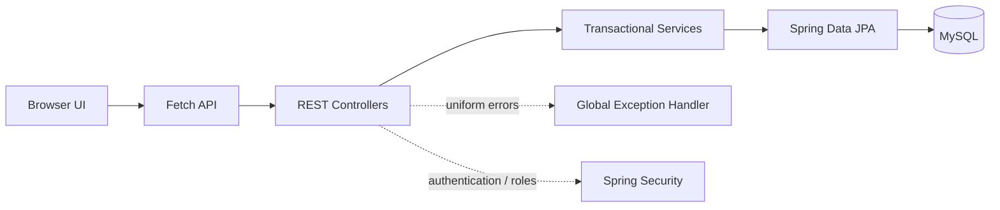
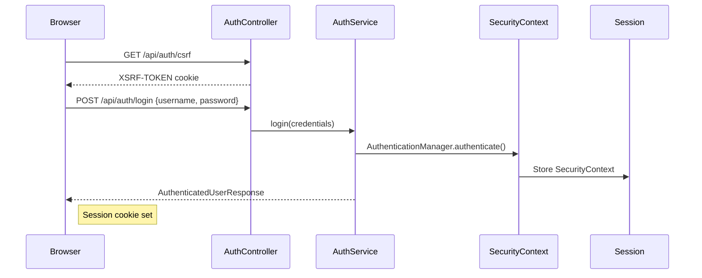
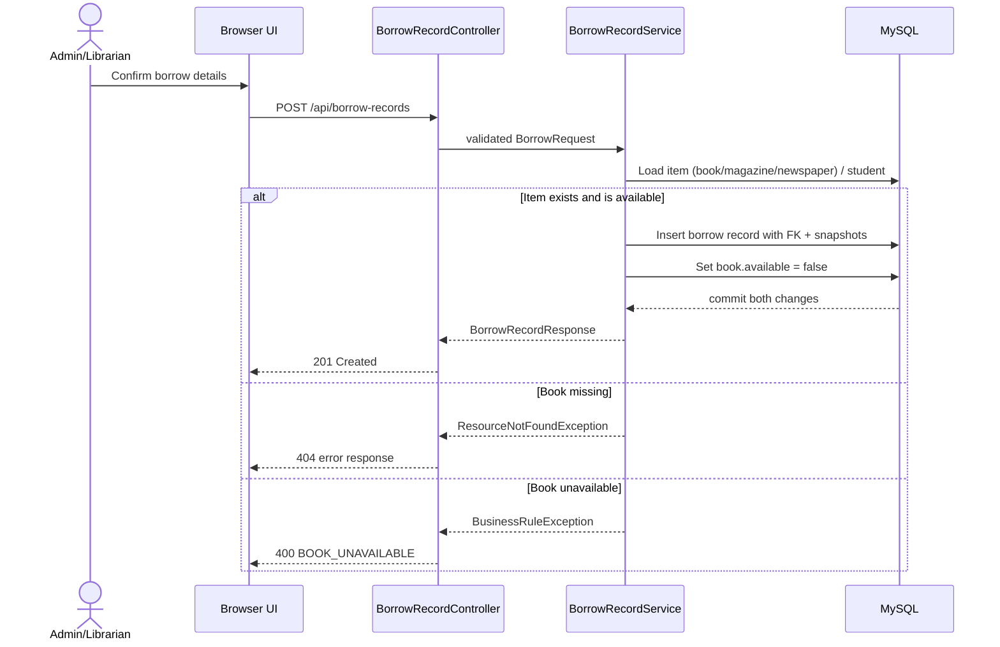

# Architecture

> **Source of truth as of:** 30 July 2026

The Library Management System is a **single-deployable Spring Boot 3.5 monolith** following a layered MVC architecture. The browser frontend is a multi-page application served as static resources from Spring Boot and communicates with the REST API through the Fetch API. No layer violations were detected — controllers never access repositories directly (except `ProfileController`, noted in §3.6), services never produce HTTP responses, and repositories contain no business logic.

**See also:** [FRONTEND.md](FRONTEND.md) for MPA structure and CSS architecture · [SECURITY.md](SECURITY.md) for auth flow and CSRF · [DATABASE.md](DATABASE.md) for ER diagram and schema · [API.md](API.md) for endpoint reference · [DESIGN/DESIGN_HISTORY.md](DESIGN/DESIGN_HISTORY.md) for pre-implementation design decisions.

---

## Table of Contents

1. [System Overview](#1-system-overview)
2. [Technology Stack](#2-technology-stack)
3. [Layered Architecture](#3-layered-architecture)
4. [Data Flow](#4-data-flow)
5. [Entities and Relationships](#5-entities-and-relationships)
6. [REST API Design](#6-rest-api-design)
7. [DTO Strategy](#7-dto-strategy)
8. [Validation](#8-validation)
9. [Error Handling](#9-error-handling)
10. [Audit and Timestamps](#10-audit-and-timestamps)
11. [Architecture Decision Records](#11-architecture-decision-records)
12. [Out of Scope for v1.0.0](#12-out-of-scope-for-v100)

---

## 1. System Overview



| Layer | Responsibility | Implementation |
|-------|----------------|----------------|
| **Presentation** | UI rendering, navigation, form collection | Multi-page application with standalone HTML files |
| **API** | REST endpoints, request validation, HTTP semantics | 14 `@RestController` classes under `/api/**` |
| **Service** | Business rules, transactions, DTO mapping | 11 `@Service` classes with `@Transactional` |
| **Persistence** | Data access | 8 `JpaRepository` interfaces with derived query methods |
| **Security** | AuthN, AuthZ, CSRF, session | Spring Security 6.5 filter chain + 5 security classes |
| **Cross-cutting** | Error handling, auditing | `@RestControllerAdvice` + `@MappedSuperclass` auditing |

---

## 2. Technology Stack

| Layer | Technology | Rationale |
|-------|------------|-----------|
| Language | Java 21 | Modern LTS suitable for Spring Boot 3.x |
| Framework | Spring Boot 3.5 | Convention-based configuration, embedded server, production-ready defaults |
| Web | Spring Web (MVC) | REST controller layer with JSON request/response |
| Security | Spring Security 6.5 | Password encoding, session security, endpoint protection, role checks |
| Persistence | Spring Data JPA + Hibernate | Repository abstraction, derived queries, schema management |
| Database | MySQL 8 (production) / H2 (tests) | Realistic relational schema with foreign keys |
| Frontend | HTML, CSS (custom properties), JavaScript (ES modules) | Extends the supplied prototype; no framework required |
| Communication | Fetch API | Native browser API; no client library needed |
| Build | Maven + Maven Wrapper | Repeatable builds without global Maven install |
| Testing | JUnit 5, MockMvc, Hamcrest, AssertJ | Integration and repository-level verification |
| CI | GitHub Actions | Automated `mvn clean verify` on push |

**Deliberately not selected:** Thymeleaf/JSP (server templates), React/Angular/Vue (framework overhead), AdminLTE (template lock-in), raw JDBC (layer violation), direct entity serialization (security risk), JWT (deferred to future scope).

See [DESIGN/DESIGN_HISTORY.md](DESIGN/DESIGN_HISTORY.md) for the full technology evaluation.

---

## 3. Layered Architecture

### 3.1 Controller layer

Controllers are HTTP adapters. They map routes and HTTP methods, accept validated request DTOs, obtain request context/principal where necessary, call a service, and return a response DTO with the correct status code. Controllers do not query repositories directly, calculate dashboard state, hash passwords, or decide borrow availability.

### 3.2 Service layer

Services contain use cases and domain rules: create/update entities, enforce role/domain preconditions, coordinate account/profile creation, calculate dashboard totals, and process borrow/return as transactions. `BorrowRecordService.borrow()` and `BorrowRecordService.returnBook()` are transactional because a record and its item availability must change together. If one write fails, neither result persists.

### 3.3 Repository layer

Repositories extend `JpaRepository` and isolate data access. All queries use derived query methods — no custom SQL. Complex business rules remain in services.

### 3.4 Persistence layer

JPA entities map to normalized MySQL tables. Hibernate generates SQL from mappings using `spring.jpa.hibernate.ddl-auto=update` for production and `ddl-auto=create-drop` for tests. No migration files exist (no Flyway or Liquibase).

### 3.5 Package structure

```text
com.example.lms
├── config/             PasswordConfig, AdminSeeder, OpenApiConfig
├── controller/         14 REST controllers
├── dto/                24 request/response records
├── entity/             8 entities + 1 superclass + 3 enums
├── event/              EntityAuditEvent, AuditEventListener
├── exception/          3 custom exceptions + 1 @RestControllerAdvice handler
├── repository/         8 JPA interfaces
├── security/           5 security classes
├── service/            11 transactional services
└── util/               CurrentUser, StringUtils
```

### 3.6 Architectural note: ProfileController layer violation

`ProfileController` directly injects `AccountRepository` and queries it without going through a service layer. This is the only controller that bypasses the service layer. A refactor to route through `AuthService` or a dedicated profile service would restore consistency.

---

## 4. Data Flow

### 4.1 Authentication flow



1. Browser loads any page (e.g., `login.html`) → JS module graph initializes.
2. `auth-api.js` calls `GET /api/auth/csrf` to obtain the `XSRF-TOKEN` cookie.
3. `auth-api.js` calls `GET /api/auth/me` to check for an existing session (silent fail if 401).
4. User submits login form → `POST /api/auth/login` with username/password JSON + CSRF header.
5. `AuthService.login()` authenticates via `AuthenticationManager`, creates a `SecurityContext`, stores it in a new HTTP session.
6. Returns `AuthenticatedUserResponse` (accountId, username, role, displayName).
7. Frontend sets `currentUser` and loads all data pages in parallel.

### 4.2 Borrow workflow



### 4.3 Return workflow

1. `POST /api/borrow-records/{id}/return` → `BorrowRecordService.returnBook()`.
2. Looks up record → throws `ResourceNotFoundException` if missing.
3. Checks if `returnDate` is already set → throws `BusinessRuleException("ALREADY_RETURNED")`.
4. Sets `returnDate = LocalDate.now()` and restores item availability (`book.setAvailable(true)`, `magazine.setAvailable(true)`, or `newspaper.setAvailable(true)`).

### 4.4 Error handling pipeline

`GlobalExceptionHandler` maps domain exceptions to uniform `ApiErrorResponse` JSON:

| Exception | HTTP Status | Error Code |
|-----------|-------------|------------|
| `ResourceNotFoundException` | 404 | `NOT_FOUND` |
| `ConflictException` | 409 | `CONFLICT` |
| `BusinessRuleException` | 400 | Code from exception (e.g. `BOOK_UNAVAILABLE`) |
| `MethodArgumentNotValidException` | 400 | `VALIDATION_ERROR` with `fieldErrors[]` |

---

## 5. Entities and Relationships

### 5.1 Entity model

| Entity | Table | Key Fields | Notes |
|--------|-------|------------|-------|
| `Account` | `accounts` | `id`, `username` (unique), `passwordHash`, `role`, `enabled` | Authentication identity only |
| `StudentProfile` | `student_profiles` | `id`, `accountId` (FK, unique), `name`, `email`, `phone` | 1:1 with Account |
| `LibrarianProfile` | `librarian_profiles` | `id`, `accountId` (FK, unique), `name`, `phone`, `age` | 1:1 with Account |
| `Book` | `books` | `id`, `title`, `author`, `isbn` (unique), `publishedDate`, `available` | `available` is a denormalized current-state flag |
| `Magazine` | `magazines` | `id`, `title`, `publisher`, `issueDate`, `category`, `featuredArticle`, `available` | Magazine catalogue entry |
| `Newspaper` | `newspapers` | `id`, `title`, `publisher`, `publicationDate`, `topHeadlines`, `available` | Newspaper catalogue entry |
| `BorrowRecord` | `borrow_records` | `id`, `bookId` (FK), `magazineId` (FK), `newspaperId` (FK), `studentId` (FK, nullable), `borrowerName`, `borrowerEmail`, `borrowerPhone`, `borrowDate`, `returnDate` | Supports borrowing books, magazines, or newspapers; snapshot fields preserve historical contact data |
| `AuditLog` | `audit_logs` | `id`, `timestamp`, `actorId`, `actorUsername`, `actorRole`, `action`, `entityType`, `entityId`, `description`, `ipAddress`, `userAgent` | Server-side audit trail with denormalized actor/entity references |

### 5.2 Relationships

```mermaid
erDiagram
    ACCOUNTS {
        BIGINT id PK
        VARCHAR username UK
        VARCHAR password_hash
        VARCHAR role
        BOOLEAN enabled
    }
    STUDENT_PROFILES {
        BIGINT id PK
        BIGINT account_id FK_UK
        VARCHAR name
        VARCHAR email
        VARCHAR phone
    }
    LIBRARIAN_PROFILES {
        BIGINT id PK
        BIGINT account_id FK_UK
        VARCHAR name
        VARCHAR phone
        INT age
    }
    BOOKS {
        BIGINT id PK
        VARCHAR title
        VARCHAR author
        VARCHAR isbn UK
        DATE published_date
        BOOLEAN available
    }
    MAGAZINES {
        BIGINT id PK
        VARCHAR title
        VARCHAR publisher
        DATE issue_date
        VARCHAR category
        VARCHAR featured_article
        BOOLEAN available
    }
    NEWSPAPERS {
        BIGINT id PK
        VARCHAR title
        VARCHAR publisher
        DATE publication_date
        VARCHAR top_headlines
        BOOLEAN available
    }
    BORROW_RECORDS {
        BIGINT id PK
        BIGINT book_id FK
        BIGINT magazine_id FK
        BIGINT newspaper_id FK
        BIGINT student_id FK
        VARCHAR borrower_name
        VARCHAR borrower_email
        VARCHAR borrower_phone
        DATE borrow_date
        DATE return_date
    }
    AUDIT_LOGS {
        BIGINT id PK
        TIMESTAMP timestamp
        BIGINT actor_id
        VARCHAR actor_username
        VARCHAR actor_role
        VARCHAR action
        VARCHAR entity_type
        BIGINT entity_id
        VARCHAR description
        VARCHAR ip_address
        VARCHAR user_agent
    }
    ACCOUNTS ||--o| STUDENT_PROFILES : "has student profile"
    ACCOUNTS ||--o| LIBRARIAN_PROFILES : "has librarian profile"
    STUDENT_PROFILES ||--o{ BORROW_RECORDS : "borrows"
    BOOKS ||--o{ BORROW_RECORDS : "appears in"
    MAGAZINES ||--o{ BORROW_RECORDS : "appears in"
    NEWSPAPERS ||--o{ BORROW_RECORDS : "appears in"
```

### 5.3 Design decisions

- **Account/profile separation:** Authentication identity (`accounts`) is separate from role-specific data (`student_profiles`, `librarian_profiles`). An admin may have no profile.
- **ISBN uniqueness:** `@Column(unique=true)` on `Book.isbn` with service-level pre-check and DB constraint fallback.
- **Borrower snapshots:** Name, email, and phone are copied from the student profile at borrow time. Profile changes do not rewrite history.
- **Denormalized availability:** `Book.available`, `Magazine.available`, and `Newspaper.available` are fast current-state fields maintained by transactional borrow/return operations.
- **Conservative deletion:** A book, magazine, or newspaper with borrow history cannot be deleted (enforced in `BookService.delete()`, `MagazineService.delete()`, `NewspaperService.delete()`).

### 5.4 Referential actions

- Deleting a book, magazine, or newspaper with borrow history → `ConflictException` (409).
- Deleting a profile that has borrow history → restricted (no explicit `CascadeType` or `orphanRemoval` on the `@OneToOne` relationship; the `Account` may be orphaned — this is a known gap).

---

## 6. REST API Design

### 6.1 Conventions

- Prefix all resources with `/api`.
- Plural nouns for collections: `/books`, `/magazines`, `/newspapers`, `/students`, `/librarians`, `/borrow-records`.
- HTTP methods: `GET` reads, `POST` creates/actions, `PUT` updates, `DELETE` removes.
- Dates in ISO-8601 `yyyy-MM-dd` format.
- Status codes: `200` OK, `201` Created (with `Location` header), `204` No Content, `400` Bad Request, `401` Unauthorized, `403` Forbidden, `404` Not Found, `409` Conflict.

### 6.2 Endpoint catalogue

| # | Method | Endpoint | Purpose | Authority |
|---|--------|----------|---------|-----------|
| 1 | GET | `/api/auth/csrf` | Bootstrap CSRF cookie | Public |
| 2 | POST | `/api/auth/login` | Authenticate and create session | Public |
| 3 | POST | `/api/auth/logout` | Invalidate session | Any authenticated |
| 4 | GET | `/api/auth/me` | Current session identity | Any authenticated |
| 5 | GET | `/api/books` | List/search books | Any authenticated |
| 6 | GET | `/api/books/{id}` | Get single book | Any authenticated |
| 7 | POST | `/api/books` | Create book | ADMIN, LIBRARIAN |
| 8 | PUT | `/api/books/{id}` | Update book | ADMIN, LIBRARIAN |
| 9 | DELETE | `/api/books/{id}` | Delete book (if no history) | ADMIN, LIBRARIAN |
| 10 | GET | `/api/students` | List students | ADMIN, LIBRARIAN |
| 11 | GET | `/api/students/{id}` | Get single student | ADMIN, LIBRARIAN |
| 12 | POST | `/api/students` | Create student + account | ADMIN, LIBRARIAN |
| 13 | PUT | `/api/students/{id}` | Update student profile | ADMIN, LIBRARIAN |
| 14 | DELETE | `/api/students/{id}` | Delete student | ADMIN, LIBRARIAN |
| 15 | GET | `/api/librarians` | List librarians | ADMIN |
| 16 | GET | `/api/librarians/{id}` | Get single librarian | ADMIN |
| 17 | POST | `/api/librarians` | Create librarian + account | ADMIN |
| 18 | PUT | `/api/librarians/{id}` | Update librarian profile | ADMIN |
| 19 | DELETE | `/api/librarians/{id}` | Delete librarian | ADMIN |
| 20 | GET | `/api/borrow-records` | List/filter borrow history | ADMIN, LIBRARIAN |
| 21 | GET | `/api/borrow-records/my` | Current user's borrow records | Any authenticated |
| 22 | POST | `/api/borrow-records` | Borrow a book | ADMIN, LIBRARIAN |
| 23 | POST | `/api/borrow-records/{id}/return` | Return a borrowed book | ADMIN, LIBRARIAN |
| 24 | GET | `/api/dashboard` | Dashboard statistics | ADMIN, LIBRARIAN |
| 25 | GET | `/api/profile` | Current user profile | Any authenticated |
| 26 | GET | `/api/magazines` | List magazines | Any authenticated |
| 27 | GET | `/api/magazines/{id}` | Get single magazine | Any authenticated |
| 28 | POST | `/api/magazines` | Create magazine | ADMIN, LIBRARIAN |
| 29 | PUT | `/api/magazines/{id}` | Update magazine | ADMIN, LIBRARIAN |
| 30 | DELETE | `/api/magazines/{id}` | Delete magazine | ADMIN, LIBRARIAN |
| 31 | GET | `/api/newspapers` | List newspapers | Any authenticated |
| 32 | GET | `/api/newspapers/{id}` | Get single newspaper | Any authenticated |
| 33 | POST | `/api/newspapers` | Create newspaper | ADMIN, LIBRARIAN |
| 34 | PUT | `/api/newspapers/{id}` | Update newspaper | ADMIN, LIBRARIAN |
| 35 | DELETE | `/api/newspapers/{id}` | Delete newspaper | ADMIN, LIBRARIAN |
| 36 | GET | `/api/student/dashboard` | Student dashboard | STUDENT |
| 37 | GET | `/api/librarian/dashboard` | Librarian dashboard | ADMIN, LIBRARIAN |
| 38 | GET | `/api/analytics/dashboard` | Analytics dashboard | ADMIN, LIBRARIAN |
| 39 | GET | `/api/analytics/trends` | Monthly borrowing trends | ADMIN, LIBRARIAN |
| 40 | GET | `/api/analytics/top-books` | Top borrowed books | ADMIN, LIBRARIAN |
| 41 | GET | `/api/analytics/top-readers` | Top readers | ADMIN, LIBRARIAN |
| 42 | GET | `/api/analytics/overdue` | Overdue summary | ADMIN, LIBRARIAN |
| 43 | GET | `/api/audit` | List audit logs | ADMIN |
| 44 | GET | `/api/audit/{id}` | Get single audit log | ADMIN |
| 45 | GET | `/api/reports/inventory` | Inventory CSV export | ADMIN, LIBRARIAN |
| 46 | GET | `/api/reports/borrowing` | Borrowing CSV export | ADMIN, LIBRARIAN |
| 47 | GET | `/api/reports/overdue` | Overdue CSV export | ADMIN, LIBRARIAN |
| 48 | GET | `/api/reports/students` | Students CSV export | ADMIN, LIBRARIAN |

All 48 endpoints are actively called by the frontend JS API modules or test files. No dead or unused endpoints were found.

### 6.3 Representative JSON contracts

<details>
<summary>Login request and response</summary>

```json
POST /api/auth/login
{
  "username": "admin",
  "password": "example-password"
}

200 OK
{
  "accountId": 1,
  "username": "admin",
  "role": "ADMIN",
  "displayName": "System Administrator"
}
```
</details>

<details>
<summary>Create book</summary>

```json
POST /api/books
{
  "title": "Clean Code",
  "author": "Robert C. Martin",
  "isbn": "9780132350884",
  "publishedDate": "2008-08-01"
}

201 Created
{
  "id": 5,
  "title": "Clean Code",
  "author": "Robert C. Martin",
  "isbn": "9780132350884",
  "publishedDate": "2008-08-01",
  "available": true
}
```
</details>

<details>
<summary>Borrow a book</summary>

```json
POST /api/borrow-records
{
  "bookId": 5,
  "studentId": 12,
  "borrowerName": "Alice Smith",
  "borrowerEmail": "alice@example.com",
  "borrowerPhone": "555-0101",
  "borrowDate": "2026-07-22"
}

201 Created
{
  "id": 7,
  "bookId": 5,
  "bookTitle": "Clean Code",
  "studentId": 12,
  "borrowerName": "Alice Smith",
  "borrowerEmail": "alice@example.com",
  "borrowerPhone": "555-0101",
  "borrowDate": "2026-07-22",
  "returnDate": null,
  "status": "BORROWED"
}
```

**Note:** The service derives borrower snapshots from the student profile, not from the request fields. The request's `borrowerName`/`borrowerEmail`/`borrowerPhone` are validated but overwritten with profile data. The `BorrowRequest` also supports `magazineId` and `newspaperId` fields for borrowing magazines or newspapers.
</details>

<details>
<summary>Uniform error response</summary>

```json
400 Bad Request
{
  "timestamp": "2026-07-22T18:52:00Z",
  "status": 400,
  "code": "BOOK_UNAVAILABLE",
  "message": "The selected book is not available for borrowing.",
  "path": "/api/borrow-records",
  "fieldErrors": []
}
```

For validation errors, `fieldErrors` contains entries such as `{ "field": "title", "message": "Title is required." }`.
</details>

---

## 7. DTO Strategy

### 7.1 Rule: entities are never API responses

JPA entities describe persistence relationships and may include passwords, hashes, internal booleans, lazy proxies, or fields that should not be changed by a client. Controllers accept request DTOs and return response DTOs only.

### 7.2 Request DTOs

| DTO | Fields | Validation |
|-----|--------|------------|
| `LoginRequest` | `username`, `password` | `@NotBlank` on both |
| `BookRequest` | `title`, `author`, `isbn`, `publishedDate` | `@NotBlank @Size(max=200)` title, `@Size(max=200)` author, `@Size(max=50)` isbn |
| `StudentRequest` | `username`, `password`, `name`, `email`, `phone` | `@NotBlank`, `@Size(min=8, max=100)` password, `@Email` |
| `StudentUpdateRequest` | `username`, `name`, `email`, `phone` | Same as StudentRequest minus password |
| `LibrarianRequest` | `username`, `password`, `name`, `age`, `phone` | `@NotBlank`, `@Size(min=8, max=100)` password, `@Min(18) @Max(100)` age |
| `LibrarianUpdateRequest` | `username`, `name`, `age`, `phone` | Same as LibrarianRequest minus password |
| `BorrowRequest` | `bookId`, `studentId`, `borrowerName`, `borrowerEmail`, `borrowerPhone`, `borrowDate` | `@NotNull` ids, `@NotBlank @Email` email, `@NotNull` date |
| `MagazineRequest` | `title`, `publisher`, `issueDate`, `category`, `featuredArticle` | `@NotBlank` title |
| `NewspaperRequest` | `title`, `publisher`, `publicationDate`, `topHeadlines` | `@NotBlank` title |

### 7.3 Response DTOs

| DTO | Exposes |
|-----|---------|
| `AuthenticatedUserResponse` | `accountId`, `username`, `role`, `displayName` |
| `BookResponse` | `id`, `title`, `author`, `isbn`, `publishedDate`, `available` |
| `StudentResponse` | `id`, `accountId`, `username`, `name`, `email`, `phone`, `role` |
| `LibrarianResponse` | `id`, `accountId`, `username`, `name`, `age`, `phone`, `role` |
| `BorrowRecordResponse` | `id`, `bookId`, `bookTitle`, `studentId`, `borrowerName`, `borrowerEmail`, `borrowerPhone`, `borrowDate`, `returnDate`, `status` |
| `DashboardResponse` | `totalStudents`, `totalLibrarians`, `totalBooks`, `borrowedBooks`, `availableBooks` |
| `StudentDashboardResponse` | Student-specific dashboard with current borrows and history |
| `MagazineResponse` | `id`, `title`, `publisher`, `issueDate`, `category`, `featuredArticle`, `available` |
| `NewspaperResponse` | `id`, `title`, `publisher`, `publicationDate`, `topHeadlines`, `available` |
| `AuditLogResponse` | `id`, `timestamp`, `actorId`, `actorUsername`, `actorRole`, `action`, `entityType`, `entityId`, `description`, `ipAddress`, `userAgent` |
| `AnalyticsDashboardResponse` | Dashboard aggregates, trends, top books, top readers, overdue |
| `TopBookResponse` | `bookId`, `title`, `borrowCount` |
| `TopReaderResponse` | `studentId`, `name`, `borrowCount` |
| `OverdueSummaryResponse` | Overdue summary data |
| `ApiErrorResponse` | `timestamp`, `status`, `code`, `message`, `path`, `fieldErrors[]` |

---

## 8. Validation

Validation operates at three levels:

### 8.1 Backend Bean Validation

All controllers use `@Valid @RequestBody` to trigger Jakarta Bean Validation. Constraints are defined on DTO fields (see §7.2).

### 8.2 Service-level business validation

| Rule | Exception | Service |
|------|-----------|---------|
| ISBN uniqueness (pre-check) | `ConflictException` | `BookService` |
| ISBN uniqueness (DB fallback) | `ConflictException` (catches `DataIntegrityViolationException`) | `BookService` |
| Book/magazine/newspaper with borrow history cannot be deleted | `ConflictException` | `BookService`, `MagazineService`, `NewspaperService` |
| Username uniqueness | `ConflictException` | `StudentService`, `LibrarianService` |
| Book must be available to borrow | `BusinessRuleException("BOOK_UNAVAILABLE")` | `BorrowRecordService` |
| Already-returned record cannot be returned again | `BusinessRuleException("ALREADY_RETURNED")` | `BorrowRecordService` |
| Entity not found | `ResourceNotFoundException` | All services |

### 8.3 Frontend validation

`modal.js` performs client-side validation:
- Required field check (empty string detection).
- Email format regex: `/^\S+@\S+\.\S+$/`.
- Server-side `fieldErrors` are rendered next to respective fields.
- General/unmatched errors displayed in a form-level summary.

---

## 9. Error Handling

`GlobalExceptionHandler` (`@RestControllerAdvice`) maps all domain exceptions to a uniform `ApiErrorResponse` JSON shape. The frontend `http.js` parses these and surfaces toast messages.

| Scenario | Handler | HTTP Status | JSON Code |
|----------|---------|-------------|-----------|
| No session / invalid credentials | `RestAuthenticationEntryPoint` | 401 | `UNAUTHORIZED` |
| Insufficient role | `RestAccessDeniedHandler` | 403 | `FORBIDDEN` |
| Resource not found | `GlobalExceptionHandler` | 404 | `NOT_FOUND` |
| State conflict | `GlobalExceptionHandler` | 409 | `CONFLICT` |
| Business rule violation | `GlobalExceptionHandler` | 400 | Code from exception |
| Validation error | `GlobalExceptionHandler` | 400 | `VALIDATION_ERROR` |

`server.error.include-message=never` prevents Spring Boot from leaking error details. `spring.jackson.default-property-inclusion=non_null` ensures null fields are omitted from JSON responses.

---

## 10. Audit and Timestamps

All entities extend `AuditableEntity`, which provides `@CreatedDate` and `@LastModifiedDate` via `@EntityListeners(AuditingEntityListener.class)`. JPA auditing is enabled by `@EnableJpaAuditing` on the application class.

An `EntityAuditEvent` JPA entity and `AuditEventListener` `@Component` are present in the `event/` package for server-side audit event tracking.

---

## 11. Architecture Decision Records

| ADR | Decision | Rationale |
|-----|----------|-----------|
| ADR-001 | REST API with Fetch, not server-rendered MVC | Reuses SPA-like prototype; clean frontend/backend boundary; API independently testable |
| ADR-002 | Retain prototype visual identity | Preserves existing work and distinctive responsive design |
| ADR-003 | Spring Boot layered architecture | Separates HTTP, rules, persistence, and transactions |
| ADR-004 | MySQL rather than embedded-only database | Real foreign keys, durable setup, realistic schema |
| ADR-005 | Account + role profile model | Normalised, supports admin without profile, clear lifecycle |
| ADR-006 | Borrow records, not only a book flag | Retains audit history, supports return date and error cases |
| ADR-007 | Foreign keys plus borrower snapshots | Combines relational integrity with time-accurate audit context |
| ADR-008 | DTOs; never expose entities directly | Security, stable contract, validation boundary, Swagger compatibility |
| ADR-009 | Session-based Spring Security with BCrypt | Secure password handling; simple same-origin browser flow |
| ADR-010 | Authentication after core CRUD | Clearer diagnosis and staged integration |
| ADR-011 | API.md before frontend integration | Prevents field/status/path mismatch |
| ADR-012 | Document from Day 1 | Preserves rationale, reduces final rush |
| ADR-013 | Defer pagination, advanced search, categories | Preserves time for correct core workflows |
| ADR-014 | Add packages only when needed | Keeps small project navigable |

See [DESIGN/DESIGN_HISTORY.md](DESIGN/DESIGN_HISTORY.md) for the full ADR discussions.

---

## 12. Out of Scope for v1.0.0

The following are deliberately deferred so the baseline remains coherent:

- **JWT:** Consider for separate clients, APIs, or stateless deployments. (OAuth2 login is implemented via Google client.)
- **Pagination and richer search:** Basic page/size pagination is implemented. Richer sort options and search filters can be added when data size warrants it.
- **Book Categories:** Add after requirements clarify whether books have one or many categories.
- **Physical book copies:** Introduce when multiple copies of one ISBN must be loaned independently.
- **Fine system:** Add due date, overdue calculation, payment/audit rules.
- **Notifications:** Email/SMS/in-app reminders.
- **Reservations/holds:** Queue/fairness and availability rules.
- **Soft deletes:** Archival flags and audit actor fields.
- **Observability:** Health endpoints, structured logs, metrics, production monitoring.

Docker Compose, Swagger/OpenAPI (springdoc), and CI (GitHub Actions) were originally deferred but are **implemented in v1.0.0**.
