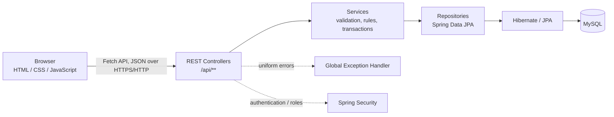
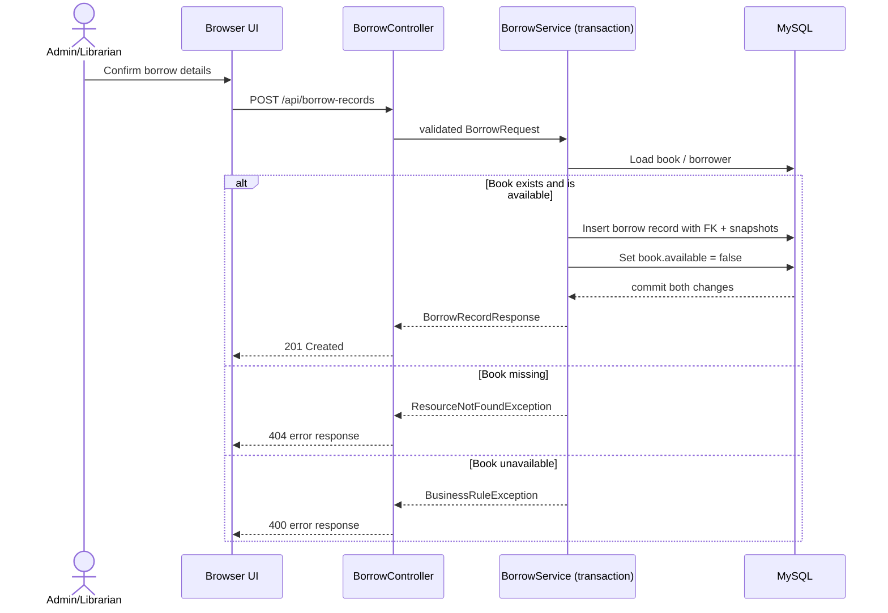

# Library Management System
## Software Architecture and Project Planning Document

**Status:** Master planning document - architecture baseline  
**Audience:** project team, reviewers, future developers, and academic assessors  
**Implementation target:** Spring Boot REST API, MySQL, and a responsive HTML/CSS/JavaScript client  
**Decision authority:** This document consolidates the decisions already made in the prototype, reference implementation, screenshots, and planning discussions. A change to a frozen decision requires an explicit Architecture Decision Record (ADR) update.

---

## Document purpose and reading guide

This is the single source of truth for the Library Management System (LMS). It is deliberately more than an overview: it records the project history, the alternatives considered, the decisions retained, and the implementation rules that follow from those decisions. A developer joining after the design phase should be able to build the system without treating the reference ASP.NET application as a technical template or reverse-engineering the original HTML prototype.

The project is **not greenfield**. It began with a functional, browser-only prototype containing Books and Borrow Records, then inherited functional requirements from an ASP.NET Core MVC learning implementation. The design then deliberately changed technology and architecture: the new solution is Java/Spring Boot with a REST API and a static JavaScript client. This document preserves both the useful functional lessons and the intentional departures.

Where artifacts conflict, the following precedence applies:

1. Frozen decisions in this document.
2. The implemented API contract and automated verification suite.
3. The reference PDFs and meeting screenshots for functional behaviour only.

### Terminology

- **Account** means the authentication identity and role, not a student or librarian profile.
- **Profile** means role-specific information attached to an account.
- **Book availability** means whether a book can be borrowed at this time.
- **Borrow record** is the durable historical transaction; it is never just a temporary UI row.
- **Current implementation** means the Spring Boot project to be created, not the ASP.NET reference application.

---

# 1. Project overview

## 1.1 Objective

The LMS will provide a responsive web application for maintaining a small library catalogue, managing students and librarians, recording book loans and returns, and presenting operational counts on a dashboard. It is an academic project, but it will use industry-standard separations of concern, API contracts, validation, documentation, and source-control practices whenever those practices do not introduce disproportionate complexity.

The project must work comfortably on desktop and mobile devices. It will use a Spring Boot backend with Spring Data JPA/Hibernate and MySQL, and a browser frontend made with HTML, CSS, JavaScript, and the Fetch API. Spring Security is part of the final architecture, but its implementation intentionally occurs after the core CRUD and borrow workflows have been proved.

## 1.2 Motivation

The initial prototype demonstrated a clean and approachable library workflow but held all data in JavaScript arrays. The reference ASP.NET MVC implementation demonstrated missing operational scope: login, dashboard, students, librarians, validation, return handling, and error scenarios. Neither artifact alone is the final product:

- The prototype has the intended visual language and a simple, responsive interaction model, but it has no persistence, user management, or real authentication.
- The reference system has useful functional coverage, but its Bootstrap MVC presentation and direct SQL/temporary login techniques do not meet the selected architecture or UI direction.

The project therefore combines the prototype's visual identity with the reference system's functional scope, while replacing its implementation approach with a maintainable Spring REST architecture.

## 1.3 In-scope outcome

The first release includes:

- Login, logout, session awareness, and a profile view.
- Role-aware Dashboard, Books, Students, Librarians, and Borrow Records modules.
- Book catalogue CRUD and availability state.
- Student and librarian CRUD, subject to role permissions.
- A borrow workflow that prevents an unavailable book from being borrowed again.
- A return workflow that preserves history and prevents a second return.
- A documented REST API, database ER diagram, black-box tests, screenshots, and daily documentation updates.

The product is a single deployable Spring Boot application. The frontend is served from the same application in normal use; it communicates with `/api/**` through Fetch. This avoids an additional hosting product and avoids CORS in the standard deployment.

## 1.4 Explicit non-goals for the first release

The following are valuable but not part of the baseline release unless a later approved ADR changes scope:

- JWT authentication and a separate public API client.
- Real-time notifications, WebSockets, or live multi-user synchronisation.
- Fine calculation, payment handling, reservations, overdue automation, or email/SMS notifications.
- Mandatory pagination or an advanced search engine; the initial dataset is expected to be small.
- A Category module despite category folders appearing in a reference screenshot.
- Migration to React, Angular, Vue, Thymeleaf, JSP, Vaadin, or an external admin template.
- Copying the reference system's Bootstrap layout.

## 1.5 Success criteria

The release is successful when a reviewer can run the system locally, authenticate with a seeded account, complete authorised CRUD actions, borrow and return books with correct availability transitions, see accurate dashboard counts, use the UI on a phone-sized viewport, and trace every behaviour to API documentation and black-box test cases.

---

# 2. Existing resources reviewed and their impact

## 2.1 HTML prototype: retained as the visual and interaction starting point

The original single-page HTML prototype was reviewed during design. It contained Home, Books, and Borrow Records views; responsive CSS; an indigo/teal design system; cards; status badges; a search field; add/edit/borrow modals; toast feedback; and client-side dummy data. The prototype demonstrated book details, edit, delete, borrow, return, local filtering, and dashboard-style counts for total titles, available titles, and items on loan.

The prototype establishes the following decisions:

- Retain the calm indigo/teal visual language, card treatment, typography hierarchy, status badges, modal/dialog pattern, and toast feedback concept.
- Retain a client-rendered, SPA-like navigation experience, but improve the information architecture for the additional modules.
- Replace the in-memory `books` and `records` arrays with server data. UI state is not a source of truth after integration.
- Retain simple vanilla JavaScript rather than introducing a framework solely to manage the existing screens.
- Extend rather than replace the design. Login, Dashboard, Students, Librarians, Profile, and Logout must look native to the prototype.

The prototype is not copied verbatim into the final resource structure. Its single file is a rapid-design artifact; production files will be separated by page/component, CSS, API client, and utility responsibilities. Its "due back" field is a useful UI consideration, but it is **not** a frozen database/API field because the agreed data model and reference borrow workflow only require borrow and return dates. It can be added later through an approved change without contaminating the initial contract.

## 2.2 Reference ASP.NET MVC PDFs: functional reference, not UI or code template

The PDFs named `BACKEND DEVELOPEMENT AND DB INTEGRATION.pdf` and `BACKEND DEVELOPEMENT AND DB INTEGRATION PART 2.pdf` document an earlier MVC learning implementation. They demonstrate:

- Book listing; add, edit, delete, details, validation, and cancel behaviour.
- Borrow forms requiring borrower name, email, and phone.
- Book availability changes on borrow and restoration on return.
- Explicit not-available and already-returned scenarios.
- Borrow history using a book relationship and transaction data.
- Login, a dashboard with counts, Student CRUD, Librarian CRUD, shared navigation, and logout.
- Search and pagination as future scope.

These establish functional expectations. They do **not** establish implementation choices. The reference uses MVC views, Bootstrap-style layout, direct SQL in controllers, temporary/hardcoded credentials, and plaintext example passwords. Those patterns are explicitly rejected for this project because they blur layers, expose credentials, and contradict the Spring/JPA/Security architecture.

## 2.3 Meeting screenshots: evidence of scope evolution and presentation expectations

The meeting screenshots confirm that Books was the original module and that Students, Librarians, Login, Dashboard, shared layout/navigation, and Logout were later added. They also show a dashboard with total student, book, librarian, and borrowing counts, and they record the expectation that database tables and data be presented clearly.

One screenshot shows a `Categories` reference folder. It is treated as evidence that categories were considered in the source material, not as an approved core module. The written planning scope did not add a `categories` table or endpoints, so Book Categories remain a future improvement. This prevents an undocumented scope expansion and respects the requirement to record rejected or deferred ideas rather than silently adopting them.

## 2.4 Prior planning material: retained decisions, retired artifacts

Earlier Spring Boot notes and planning research surveyed alternatives such as direct controller-to-repository CRUD, a service layer, a simple borrowed flag, a dedicated loan entity, server-side templates, JavaScript frameworks, admin templates, Swagger, and test documentation. Their adopted decisions have been consolidated into this document and the current implementation; their retired source files are intentionally not part of the v1.0.0 release tree.

---

# 3. Functional requirements

## 3.1 Roles and access model

The system has three roles:

| Role | Primary responsibility | Permitted baseline actions |
| --- | --- | --- |
| ADMIN | System administration | Manage students, librarians, books, all borrow records, dashboard, and own profile. |
| LIBRARIAN | Day-to-day library operation | View dashboard, manage books and students, process borrow/return, view records, own profile. Cannot manage librarians. |
| STUDENT | Catalogue and personal usage | View available catalogue and own profile; may initiate or request a borrow only through the approved workflow. Cannot manage accounts, books, or other users. |

The exact frontend menu is role-aware; unavailable actions should not be shown as if they were available. Backend role enforcement remains authoritative even if a UI control is hidden.

## 3.2 Login

The Login module accepts username and password, submits them to the authentication API, creates a session on success, and presents an actionable failure message on invalid credentials. The frontend checks the current session on application load through `/api/auth/me`, so a logged-in user returns to the suitable authenticated view rather than seeing an incorrect public state.

The reference implementation demonstrated a login screen and success redirect, but used temporary in-memory matching and plaintext sample values. The new system retains the user flow, not the insecure storage mechanism. Passwords are BCrypt hashes; successful login returns non-sensitive account information and relies on an HttpOnly session cookie rather than returning a password or token.

## 3.3 Dashboard

The Dashboard provides operational totals. At minimum it displays total students, total librarians, total books, and currently borrowed books. The earlier prototype's total/available/on-loan metrics remain valuable and can be shown alongside the required totals where the layout supports it. Values are fetched from the server, never calculated from only the current page's DOM.

The dashboard is an operational summary, not an analytics platform. It does not initially require charts, historical trend reports, or real-time refresh.

## 3.4 Books

The Books module provides:

- List books with title, author, ISBN, publication date, and availability.
- View a book by identifier and display its complete supported fields.
- Add and edit books with server and client validation.
- Delete a book only when the deletion policy permits it; a book with historical borrow records must not be silently deleted in a way that destroys audit history.
- Filter/search by title or author in the initial small-data implementation.
- Show a clear Available/Borrowed status.
- Start a borrow operation only for an available book.

The prototype has a Delete action that removes an item from its JavaScript array. In the persisted system, deletion must return a conflict response when a historical record would be invalidated. The baseline policy is therefore: a book with any borrow history is not deletable; an administrator must retain the catalogue entry or future work may introduce archival/soft delete. This is an intentional safety refinement of the prototype.

## 3.5 Students

The Students module lets an authorised administrator or librarian list, view, create, update, and delete student profiles. Creation establishes an `accounts` row with the `STUDENT` role and a matching `student_profiles` row in a single transaction. A profile contains display/contact information such as name, email, and phone; credentials remain in `accounts`.

The reference system had fields beyond the initial Spring plan, such as gender and address. The adopted baseline retains the fields explicitly planned for the new schema: name, email, and phone. Additional fields may be added later only if a requirement makes their purpose clear; they are not copied merely because the old SQL table contained them.

## 3.6 Librarians

The Librarians module lets only an administrator list, view, create, update, and delete librarian profiles. Creation establishes an `accounts` row with the `LIBRARIAN` role and a matching `librarian_profiles` row. Baseline profile fields are name, phone, and age, reflecting the reference workflow. Age is stored only because it is part of the inherited functional scope; it is not used for authorisation or business rules.

## 3.7 Borrow records

The Borrow Records module is the system of record for loan history. It provides an authorised user with a list of current and completed loans, optional status filtering, and enough information to identify the book, borrower, borrow date, and return date.

A borrow action must:

1. Load the book and verify it exists.
2. Verify it is available.
3. Validate borrower details.
4. Create a borrow record, including foreign key(s) and snapshot fields.
5. Set the book to unavailable in the same transaction.
6. Return `201 Created` with the new record.

A return action must:

1. Load the borrow record and associated book.
2. Fail with `404` if the record does not exist.
3. Fail with `400` if it has already been returned.
4. Set its return date and restore book availability in the same transaction.
5. Return `204 No Content`.

The return action does not delete or overwrite the borrow record. The reference PDFs explicitly teach the `already returned` case, and the final system keeps this as a domain rule rather than just a disabled button.

## 3.8 Profile and logout

Profile shows the authenticated user's non-sensitive identity information, role, and applicable profile details. Logout invalidates the current session and returns the browser to the login state. Neither endpoint exposes a password hash, raw password, or arbitrary account record.

---

# 4. Non-functional requirements

| Area | Requirement and design response |
| --- | --- |
| Performance | The initial library dataset is small. Typical list and mutation requests should complete quickly on a local development deployment. Repository queries, indexes on foreign keys and unique identifiers, and narrow DTO responses avoid unnecessary work. Pagination is deferred but the API is designed so it can be added without changing resource ownership. |
| Scalability | The stateless REST controller/service structure and relational design allow later growth. The initial session-based auth is sufficient for one deployed application; clustered session management is outside the academic baseline. Pagination, cache strategy, and index tuning are future extensions. |
| Security | Passwords are BCrypt-hashed; entities are not returned directly; role checks happen server-side; input is validated; errors do not disclose stacks or hashes. Same-origin hosting reduces CORS surface. CSRF must be deliberately configured, not ignored. |
| Maintainability | Controller, service, repository, entity, DTO, configuration, exception, and security responsibilities are separated. Each feature has a predictable API client and page/controller path. Documentation and a changelog are maintained daily. |
| Reliability | Borrow/return changes are transactional, enforce preconditions, and retain transaction history. Foreign keys and unique constraints guard relationships. Global exception handling produces consistent response bodies. |
| Availability | The baseline is a local/single-service academic deployment. Availability is improved by clear setup, backups/SQL export, and reproducible seed data; high availability is not claimed. |
| Usability | Clear labels, validation feedback, disabled/unavailable actions, meaningful empty states, confirmation for destructive operations, and toast/error feedback are required. A user should understand why a borrow or return failed. |
| Responsiveness | Mobile-first CSS; touch-friendly controls; readable cards/forms; a collapsible navigation pattern; and table-to-card or horizontal-scroll treatment on narrow screens are required. |
| Compatibility | The UI targets current evergreen desktop and mobile browsers using standard HTML, CSS, JavaScript, and Fetch. No framework-specific client runtime is required. |
| Accessibility | Semantic controls, associated labels, keyboard-accessible dialogs/actions, sufficient contrast, visible focus state, and non-colour-only status cues are expected. This is a quality requirement even for an academic project. |
| Observability | Development logs must capture unexpected server errors without leaking internal details to the client. A future deployment can add metrics/health checks. |
| Data integrity | MySQL constraints, JPA mappings, unique usernames, profile one-to-one constraints, transactional service methods, and delete restrictions protect correctness. |
| Documentation quality | API.md, README, Architecture, requirements, test evidence, screenshots, diagrams, and CHANGELOG are living artifacts updated with work, not an end-of-project task. |

---

# 5. Technology stack and alternatives

## 5.1 Selected technologies

| Technology | Selected use | Why it is selected |
| --- | --- | --- |
| Java 21 | Application language/runtime | Modern LTS Java suitable for Spring Boot 3.x and common in enterprise Java development. |
| Spring Boot | Application bootstrap and configuration | Reduces boilerplate, provides embedded server support, convention-based configuration, and an appropriate foundation for REST services. |
| Spring Web / Spring MVC | REST controller layer | Maps HTTP resources to controller methods and supports JSON request/response handling. |
| Spring Data JPA | Repository abstraction | Provides repository methods and derived/custom queries without hand-writing repetitive data access code. |
| Hibernate | JPA implementation / ORM | Maps relational tables to Java entities and works naturally with Spring Data JPA. |
| MySQL 8 | Persistent relational database | Provides a realistic, durable relational schema with foreign keys and is preferable to a transient embedded database for the project outcome. |
| HTML / CSS / JavaScript | Responsive frontend | Directly extends the existing prototype; keeps the client light, transparent, and easy to review. |
| Fetch API | Browser-to-REST communication | Native browser API; no client library required; supports JSON, error handling, and session credentials. |
| Spring Security | Authentication and authorisation | The standard Spring mechanism for password encoding, session security context, endpoint protection, and role checks. |
| BCryptPasswordEncoder | Password hashing | Slow, salted adaptive hashing; passwords are never stored in plaintext. |
| Maven wrapper | Build and run | Repeatable project commands without assuming a globally installed Maven version. |
| Postman / curl | API verification | Allows the API contract and error cases to be tested independently of the UI. |
| Git and GitHub | Version control/project tracking | Provides traceability, reviewable commits, issue tracking, and an auditable project history. |
| Markdown + Mermaid/draw.io | Documentation and diagrams | Easy to version alongside code; Mermaid diagrams render from text, while draw.io exports can be included if required for submission. |

## 5.2 Deliberately not selected for the baseline

### Server-rendered Thymeleaf/JSP/MVC views

This was a reasonable alternative because the reference application uses MVC pages. It was rejected because the working prototype is already a client-rendered application and the project explicitly benefits from a REST boundary. Introducing server templates would duplicate frontend work, make the Fetch-based integration unnecessary, and change the UI evolution path.

### React, Angular, Vue, and Vaadin

These frameworks can build capable applications, but they add a new build pipeline, framework concepts, and component conventions without solving a problem the prototype cannot solve. The project scope is moderate and vanilla JavaScript is sufficient. The decision is not a claim that frameworks are inferior; it is a scope and reuse decision.

### AdminLTE/CoreUI or copying Bootstrap screens

Admin dashboards could accelerate generic layout work, but they would replace the provided visual direction. The reference Bootstrap UI supplies feature ideas only. The team keeps the existing bespoke prototype and evolves it.

### H2 or another embedded database

An embedded database simplifies demos but weakens the objective of demonstrating a realistic relational schema, foreign keys, SQL scripts, and durable setup. MySQL is the selected target. H2 may be used only for isolated tests later if it does not hide MySQL-specific behaviour.

### Raw JDBC/direct SQL in controllers

The reference shows `SqlConnection` and SQL statements directly in MVC controllers. This was rejected because it couples HTTP handling, SQL, mapping, and business rules; it makes transaction policy and tests harder to maintain. Spring Data JPA repositories plus services are selected.

### Direct entity serialisation

Returning JPA entities is quick for a prototype but exposes persistence design and risks leaking password hashes, lazy relationships, or internal fields. DTOs are mandatory.

### JWT for first release

JWT was considered for a modern stateless API but is deferred. It adds token issuance, storage, expiry, refresh, revocation, and client security concerns. For a same-origin academic full-stack application, server sessions are simpler and safer to implement correctly. JWT is recorded as a future improvement.

---

# 6. System architecture

## 6.1 High-level architecture



The flow is Browser -> Fetch API -> Controller -> Service -> Repository -> MySQL. Dependencies point inward: the browser does not know the database; controllers do not contain business rule orchestration; repositories do not render HTTP responses. Security intercepts requests before protected controller code and service transactions protect state transitions.

## 6.2 Browser and Fetch API layer

The browser owns layout, input collection, client-side usability validation, navigation state, rendering, and presentation of server responses. It sends JSON requests and receives JSON responses. Each API call uses a common helper that sets `Content-Type: application/json` where a body exists, uses `credentials: 'include'` for session cookies, parses an error response consistently, and routes user-facing feedback to the toast or form error region.

The browser must not assume a request succeeded merely because it was sent. It updates displayed data only from the API response or a confirmed reload. It must not implement authorisation as its only control; hiding an action is a usability feature, not a security boundary.

## 6.3 Controller layer

Controllers are HTTP adapters. They map routes and HTTP methods, accept validated request DTOs, obtain request context/principal where necessary, call a service, and return a response DTO with the correct status code. Controllers do not query repositories directly, calculate dashboard state, hash passwords, or decide borrow availability.

## 6.4 Service layer

Services contain use cases and domain rules: create/update entities, enforce role/domain preconditions, coordinate account/profile creation, calculate dashboard totals, and process borrow/return as transactions. `BorrowService.borrow(...)` and `BorrowService.returnBorrow(...)` are transactional because a record and its book availability must change together. If one write fails, neither result may persist.

## 6.5 Repository layer

Repositories extend `JpaRepository` and isolate data access. Examples include `BookRepository`, `AccountRepository`, `StudentProfileRepository`, `LibrarianProfileRepository`, and `BorrowRecordRepository`. Repositories expose straightforward CRUD and narrowly named queries such as availability counts or filtered borrow records. Complex business rules remain in services.

## 6.6 Persistence layer

JPA entities map to normalized MySQL tables. Hibernate generates SQL from mappings; local development may initially use `spring.jpa.hibernate.ddl-auto=update` to accelerate setup. This setting is convenient during active schema creation but is not a production migration strategy. Before final submission, the project must provide a schema/data script or documented database setup so the schema is reproducible.

---

# 7. Frontend architecture

## 7.1 Approach

The frontend remains framework-free and evolves the supplied prototype. It is a lightweight client application served as static Spring Boot resources. It will use page sections or small page modules, not a large framework router. This keeps the project aligned with the existing HTML while making the code maintainable as modules grow.

## 7.2 Planned frontend structure

```text
src/main/resources/static/
├── index.html                    # application shell and page mounting areas
├── pages/
│   ├── login.html                # optional fragment/template if separate page chosen
│   ├── dashboard.js
│   ├── books.js
│   ├── students.js
│   ├── librarians.js
│   ├── borrow-records.js
│   └── profile.js
├── components/
│   ├── navbar.js
│   ├── modal.js
│   ├── toast.js
│   ├── table.js
│   └── empty-state.js
├── css/
│   ├── tokens.css
│   ├── base.css
│   ├── layout.css
│   ├── components.css
│   └── responsive.css
├── js/
│   ├── main.js
│   ├── router.js
│   ├── state.js
│   ├── api/
│   │   ├── http.js
│   │   ├── auth-api.js
│   │   ├── dashboard-api.js
│   │   ├── books-api.js
│   │   ├── students-api.js
│   │   ├── librarians-api.js
│   │   └── borrow-api.js
│   └── utils/
│       ├── dates.js
│       ├── validation.js
│       └── dom.js
└── assets/
    ├── icons/
    └── images/
```

The `pages/` directory contains module-specific rendering and event binding; `components/` holds reusable visual behaviours; `css/` separates tokens and responsive rules from page logic; `js/api/` is the sole place that knows endpoint paths; `utils/` contains generic formatting and safe DOM helper functions; `assets/` holds stable static files. This structure is preferred over maintaining a single 21 KB HTML/inline-script file because each new module can be changed without destabilising unrelated views.

The final physical layout may use only `index.html` plus JavaScript-rendered sections, or small HTML fragments, but it must retain the separation above. It must not require a separate frontend build/server for the baseline deployment.

## 7.3 UI data and safety rules

- Server JSON is the source of truth after integration.
- Rendering must avoid injecting untrusted text through unsafe `innerHTML`; use escaping or DOM APIs for user-controlled values.
- Forms perform immediate required/format checks for usability, but the server repeats all validation.
- Buttons must show pending/disabled state during a mutation to avoid accidental duplicate requests.
- Destructive actions require confirmation and handle conflicts cleanly.
- API errors are mapped to contextual form errors or toast messages without exposing Java stack traces.

---

# 8. Backend architecture

## 8.1 Package structure

```text
backend/
├── pom.xml
├── mvnw
├── src/
│   ├── main/
│   │   ├── java/com/example/lms/
│   │   │   ├── LibraryManagementApplication.java
│   │   │   ├── controller/
│   │   │   ├── service/
│   │   │   ├── repository/
│   │   │   ├── entity/
│   │   │   ├── dto/
│   │   │   ├── config/
│   │   │   ├── exception/
│   │   │   └── security/
│   │   └── resources/
│   │       ├── application.properties
│   │       ├── static/             # frontend shown in Section 7
│   │       └── db/                 # schema/seed scripts if adopted
│   └── test/java/com/example/lms/
│       ├── service/
│       ├── controller/
│       └── integration/
└── docs/
```

If repository-root layout is selected instead of a `backend/` child folder, the package contents remain the same; the important decision is clear ownership, not an arbitrary top-level folder name.

| Package | Responsibility |
| --- | --- |
| `controller` | REST routes, HTTP status selection, DTO input/output, and request binding. |
| `service` | Business use cases, transactions, authorisation-aware orchestration, and mapping coordination. |
| `repository` | `JpaRepository` interfaces and narrowly scoped queries. |
| `entity` | JPA persistence models and relationships only. |
| `dto` | Request/response types, validation annotations, and stable API schemas. |
| `config` | Application settings such as CORS only if required, Jackson/date configuration, and beans. |
| `exception` | Domain exceptions, error response model, and `@RestControllerAdvice`. |
| `security` | `SecurityConfig`, authenticated-user helpers, and custom user-details support where required. |

## 8.2 Deliberate restraint on extra packages

`mapper`, `util`, `constants`, and `response` are not created pre-emptively. They are useful only after a real responsibility appears:

- Add `mapper` when DTO/entity conversion becomes repeated enough to obscure services.
- Add `util` when a helper is genuinely generic and used in multiple modules.
- Add `constants` when shared named values are stable and not better represented by enums/configuration.
- Add `response` when multiple response envelopes exist beyond the error model and DTOs.

Premature folder creation makes a small project look structured while scattering code unnecessarily. The selected baseline keeps the package tree small and expands it only for demonstrated cohesion.

---

# 9. Database design

## 9.1 Design objective

The schema must support authentication, role-specific user data, catalogue records, durable borrow history, and future growth without mixing unrelated responsibilities in one table. It must retain a meaningful transaction history when a profile changes. The selected database is MySQL and the application accesses it through JPA/Hibernate.

## 9.2 Alternatives considered

### Option A - one `users` table

**Proposal:** Store credentials, role, student fields, librarian fields, and possibly admin information in one wide table.

| Advantages | Disadvantages |
| --- | --- |
| Quick to create and simple for a very small demo. | A student and librarian need different attributes, producing many nullable or irrelevant columns. |
| One table for login lookup. | Authentication data and public/profile data are coupled. |
| Fewer joins in a trivial list. | It becomes harder to represent an admin with no student/librarian profile, and later role-specific fields cause continual schema changes. |
| | It obscures the difference between an identity and a role-specific business profile. |

**Decision:** Rejected. A single wide table is superficially simpler but weakens normalization and makes role evolution awkward.

### Option B - fully separate `users`, `students`, and `librarians` tables

**Proposal:** Keep a separate users/login table and separate student and librarian tables, but allow them to be independently managed without a strict one-to-one account/profile relation.

| Advantages | Disadvantages |
| --- | --- |
| Keeps some role-specific fields out of `users`. | The ownership and lifecycle relationship is ambiguous: a profile may exist without a login account or account creation may become duplicated. |
| Mirrors the reference application's visibly separate models/tables. | Login/account rules can be repeated across separate tables. |
| Can be familiar to beginners. | It does not cleanly express that both types share one authentication identity model. |

**Decision:** Not adopted as written. Its useful insight - separate role data - is retained, but it is refined into one shared account table with strict profile one-to-one relationships.

### Early simple loan approach - only a `borrowed` flag on `books`

**Proposal:** Toggle a boolean and perhaps store `borrowedBy` directly on the book, without a separate transaction entity.

**Why it was considered:** It makes a first CRUD demo very small and appears in generic tutorials.

**Why it was rejected:** It loses loan history, cannot reliably model completed loans, cannot identify a double return, and cannot meet the reference requirement to show borrow records. The availability flag remains as a fast current-state field, but it is not a substitute for history.

## 9.3 Final adopted schema

The approved initial schema is:

- `accounts`
- `student_profiles`
- `librarian_profiles`
- `books`
- `borrow_records`

```mermaid
erDiagram
    ACCOUNTS {
        BIGINT id PK
        VARCHAR username UK
        VARCHAR password_hash
        VARCHAR role
        BOOLEAN enabled
    }
    STUDENT_PROFILES {
        BIGINT id PK
        BIGINT account_id FK_UK
        VARCHAR name
        VARCHAR email
        VARCHAR phone
    }
    LIBRARIAN_PROFILES {
        BIGINT id PK
        BIGINT account_id FK_UK
        VARCHAR name
        VARCHAR phone
        INT age
    }
    BOOKS {
        BIGINT id PK
        VARCHAR title
        VARCHAR author
        VARCHAR isbn
        DATE published_date
        BOOLEAN available
    }
    BORROW_RECORDS {
        BIGINT id PK
        BIGINT book_id FK
        BIGINT student_id FK
        VARCHAR borrower_name
        VARCHAR borrower_email
        VARCHAR borrower_phone
        DATE borrow_date
        DATE return_date
    }
    ACCOUNTS ||--o| STUDENT_PROFILES : "has student profile"
    ACCOUNTS ||--o| LIBRARIAN_PROFILES : "has librarian profile"
    STUDENT_PROFILES ||--o{ BORROW_RECORDS : "borrows"
    BOOKS ||--o{ BORROW_RECORDS : "appears in"
```

### `accounts`

`accounts` holds the shared login identity: primary key, unique username, BCrypt password hash, role enum/string (`ADMIN`, `LIBRARIAN`, `STUDENT`), and enabled state. An admin may have no profile. The table must never store a plaintext password or profile-only fields such as age.

### `student_profiles`

`student_profiles.account_id` is `NOT NULL`, `UNIQUE`, and references `accounts.id`. It holds the selected student display/contact data: name, email, and phone. The account must have the `STUDENT` role; the service layer enforces this invariant. The profile's own surrogate key exists for simple JPA/entity handling, while `account_id` is the business one-to-one key.

### `librarian_profiles`

`librarian_profiles.account_id` has the same one-to-one constraint and holds name, phone, and inherited age. It is permitted only for an account with the `LIBRARIAN` role. There is no need for a separate `admin_profiles` table in this release.

### `books`

`books` holds title, author, ISBN, publication date, and a boolean availability state. `available = true` means no active loan is expected. `available = false` means a current borrow record exists. The `available` field deliberately denormalizes current state for easy querying and dashboard counts; its correctness is protected by the transactional borrow/return operations. ISBN uniqueness is desirable when the library represents a single catalogue item per ISBN, but the project has not committed to supporting multiple physical copies; do not impose a unique ISBN constraint until this business rule is confirmed. Title is required; author, ISBN, and published date use validation appropriate to the final form requirements.

### `borrow_records`

`borrow_records` stores a primary key, required `book_id`, optional/required-as-workflow-dictates `student_id`, borrower snapshot fields, required borrow date, and nullable return date. `return_date IS NULL` represents a current loan. A book can have many historical records; a student profile can have many records. The relationship is not one-to-one.

The Spring planning report originally listed name and email snapshots, whereas the reference borrow form also includes phone. The final baseline includes **name, email, and phone** snapshots because all are collected in the inherited workflow. This is a refinement that avoids losing a supplied contact detail from the transaction record.

## 9.4 Keys, constraints, and indexes

| Table | Key/constraint | Purpose |
| --- | --- | --- |
| `accounts` | PK `id`; unique, non-null `username`; non-null `password_hash`, `role` | Prevent duplicate identities and ensure every account is usable by security logic. |
| profile tables | PK `id`; unique, non-null FK `account_id` | Enforce the intended one profile per matching account. |
| `books` | PK `id`; non-null `title`; non-null `available` default true | Identifies catalogue entries and guarantees a defined current state. |
| `borrow_records` | PK `id`; non-null FK `book_id`; non-null `borrow_date` | Makes each history event identifiable and connected to a book. |
| `borrow_records` | FK `student_id` where the workflow uses a known student | Preserves relational traceability while allowing carefully defined guest/manual data only if the requirements later permit it. |

Foreign key columns need indexes; MySQL normally indexes these as part of constraint support, but migrations/schema scripts should make intent explicit when needed. Useful query indexes include `books(available)`, `borrow_records(return_date)`, and searchable text columns if search grows. The baseline does not introduce database triggers; application transactions manage the state change so logic remains visible and testable in the service layer.

## 9.5 Referential-action policy

The source planning example suggested cascading account/profile and book/borrow deletion. The final policy is more conservative because audit history is a stated requirement:

- Deleting an account/profile that has borrow history must be restricted or converted to a soft-disable/archival operation. A cascading delete would erase history.
- Deleting a book that has borrow history is restricted. It may be marked inactive in a future enhancement.
- Deleting an unused profile/account can be allowed through a transactional service operation that ensures no protected relationship exists.

This changes the earlier tutorial-style `ON DELETE CASCADE` example intentionally. It is not a rejection of foreign keys; it is a refinement to align the database with audit retention.

## 9.6 Normalization and planned denormalization

The schema is normalized to separate identity credentials, student data, librarian data, books, and borrow events. Each non-key field belongs to the entity it describes. The two intentional denormalizations are:

1. `books.available`, a current-state projection maintained with every active loan change.
2. Borrower snapshot fields in `borrow_records`, a historical record of contact information at the time of borrowing.

Neither is accidental duplication. Each has a specific query/audit purpose and a service-level rule that maintains it.

## 9.7 Future scalability

The schema can later add `book_categories`, `book_copies`, `fines`, `reservations`, and notifications without redesigning accounts or historical loans. In particular, if the system must manage multiple physical copies of one title, a `book_copies` table should replace the assumption that one `books` record is one borrowable item. That is intentionally future scope, not a silent alteration of the initial model.

---

# 10. Authentication and authorisation design

## 10.1 Why Spring Security is selected

Authentication is not merely a login form. It requires reliable password matching, a persisted authenticated identity, role checks, session lifecycle, access-denied behaviour, and endpoint protection. Spring Security is selected because it supplies these security primitives in the native Spring ecosystem rather than requiring custom, error-prone authentication code.

## 10.2 BCrypt password storage

Passwords are processed using `BCryptPasswordEncoder`. A new password is encoded before the account is saved; login uses BCrypt's verification method. The database stores the resulting hash only. The reference's `logintab` examples and hardcoded credentials were instructional shortcuts; storing or comparing plaintext passwords is explicitly forbidden in the final system.

## 10.3 Session-based authentication

On successful login the application establishes an HTTP session containing the Spring Security context. The browser sends the session cookie with Fetch calls using `credentials: 'include'`. The `GET /api/auth/me` endpoint provides safe identity/role data to initialise the client. Logout invalidates the session.

Sessions are chosen over JWT for the first release because the browser and API share one origin, the application is a single academic deployment, and the team needs to focus on correct CRUD/business behaviour. JWT remains a valid future alternative once token lifecycle and deployment needs justify its complexity.

## 10.4 Access-control matrix

| Resource/action | ADMIN | LIBRARIAN | STUDENT | Unauthenticated |
| --- | ---: | ---: | ---: | ---: |
| Login / logout / current session | yes | yes | yes | login only / no session for `me` |
| Dashboard | yes | yes | no | no |
| View books | yes | yes | yes | no after security phase |
| Create/edit/delete books | yes | yes | no | no |
| View/manage students | yes | yes | own profile only | no |
| Manage librarians | yes | no | no | no |
| View borrow records | yes | yes | own records only if student view is implemented | no |
| Process borrow and return | yes | yes | request/self-service only if approved | no |
| Own profile | yes | yes | yes | no |

The previous planning text uses phrases such as "student can request a borrow" and a general `POST /api/borrow` contract with borrower details. The frozen interpretation is that staff process normal loans; any student self-service request must be added as an explicit workflow and must not let a student submit another person's details. Until that ADR exists, the borrow mutation endpoint is ADMIN/LIBRARIAN only.

## 10.5 CSRF and CORS

Same-origin deployment avoids a normal CORS requirement. If a separate frontend development server is used temporarily, CORS must allow only the known development origin and methods/headers; `*` is not a production default.

Because session cookies are used, CSRF must be consciously addressed. The baseline preferred implementation is Spring Security CSRF protection with a token exposed in a safe same-origin mechanism and attached by the common Fetch helper on state-changing requests. Disabling CSRF is not the frozen production design. It may be temporarily documented for an isolated early CRUD stage before authentication exists, but it must not remain unnoticed when sessions are enabled.

## 10.6 Why authentication is implemented after CRUD

Security is architecture-critical but scheduling it immediately obscures basic API defects with authentication/configuration failures. The team first creates entities, repositories, service rules, CRUD endpoints, and independent Postman tests. This makes it possible to prove that a bad borrow fails for the business reason "book unavailable," not because a security configuration blocked it. On Day 9, Spring Security wraps already-working endpoints and role tests validate the final access model. Delayed implementation is a sequencing decision, not a claim that authentication is optional or unimportant.

---

# 11. Borrow record design and audit history

## 11.1 Foreign keys plus snapshots

Using only `book_id` and `student_id` would preserve relationships but not the borrower details that were true when the item left the library. A student can change name, email, or phone. An account may later be disabled or archived. A loan record must still answer who borrowed the book and how the operation was recorded at that time.

Each `borrow_records` row therefore stores both:

- **Foreign keys:** `book_id` and the borrower/student account identifier where applicable, enabling joins, constraints, and current-record navigation.
- **Snapshots:** borrower name, email, and phone copied at loan creation, preserving an auditable historical view.

The snapshot is not used to authenticate a person or replace the relationship. It is a time-bound record. When a profile is updated, prior snapshots are not rewritten.

## 11.2 State transition and transaction boundary



Borrow and return must use `@Transactional` service methods. The transaction means no persisted record exists with an unchanged available flag, and no book is unavailable without the intended record because an exception rolls back both changes.

## 11.3 Concurrency consideration

Two staff members could attempt to borrow the final available copy at nearly the same moment. The service-level availability check alone is not a complete long-term concurrency strategy. For the small academic deployment it is sufficient to begin with a transactional check; if concurrent use is tested, add optimistic locking (`@Version`) on `Book` or an appropriate pessimistic lock so only one transaction succeeds. This is recorded as a hardening improvement, not omitted as an invisible risk.

---

# 12. DTO strategy

## 12.1 Rule: entities are never API responses

JPA entities describe persistence relationships and may include passwords, hashes, internal booleans, lazy proxies, or fields that should not be changed by a client. Returning them directly lets database evolution leak into the API and can accidentally reveal data. Controllers therefore accept request DTOs and return response DTOs only.

## 12.2 Request DTOs

Request DTOs describe client-controlled input and include Bean Validation constraints. Expected types include:

- `LoginRequest` - username and password.
- `BookRequest` - title, author, ISBN, published date.
- `StudentCreateRequest` / `StudentUpdateRequest` - profile fields and password only where creation/reset allows it.
- `LibrarianCreateRequest` / `LibrarianUpdateRequest`.
- `BorrowRequest` - book identifier, selected/known student identifier where relevant, and required borrower contact data.

Validation annotations such as `@NotBlank`, `@Email`, `@Size`, and sensible numeric/date limits provide consistent `400 Bad Request` responses. DTO validation never replaces the service's availability, uniqueness, or role checks.

## 12.3 Response DTOs

Response DTOs expose only the data a consumer needs:

- `AuthenticatedUserResponse` contains username, role, display name, and account/profile identifiers if necessary - never password/hash.
- `BookResponse` contains id, title, author, ISBN, published date, and available flag.
- `StudentResponse` and `LibrarianResponse` contain role-specific public/admin fields.
- `BorrowRecordResponse` contains record/book identifiers, book display data as appropriate, snapshots, borrow/return dates, and derived status.
- `DashboardResponse` contains the defined counts.
- `ApiErrorResponse` contains timestamp, status, error code, message, path, and field errors when validation fails.

## 12.4 Benefits

DTOs stabilise the API even when entity fields change; protect secrets and persistence internals; give frontend developers a small documented contract; make Bean Validation explicit; simplify Swagger/OpenAPI generation later; prevent mass assignment; and make tests assert a deliberate JSON shape. Mapping can initially live in feature services. A dedicated mapper package is added only after mapping duplication justifies it.

---

# 13. REST API design

## 13.1 Principles and conventions

- Prefix application resources with `/api`.
- Use plural nouns for collections: `/books`, `/students`, `/librarians`, `/borrow-records`.
- Use HTTP methods according to intent: `GET` reads, `POST` creates/actions, `PUT` replaces/updates a known resource, `DELETE` removes.
- Use identifiers in the path and filtering/search in query parameters.
- Return JSON with ISO-8601 `yyyy-MM-dd` dates.
- Use `201 Created` for successful creation, `200 OK` for successful reads/updates, `204 No Content` for successful deletion/return, `400` for validation or business-rule errors, `401` for no authenticated session, `403` for authenticated but unauthorised callers, `404` for missing resources, and `409` for deletion/state conflicts where applicable.
- Do not encode verbs into ordinary resource paths. Borrow and return are explicit domain commands, so their action paths are acceptable exceptions.

## 13.2 Endpoint catalogue

| Method | Endpoint | Purpose | Authority | Success |
| --- | --- | --- | --- | --- |
| POST | `/api/auth/login` | Authenticate and establish session | public | 200 |
| POST | `/api/auth/logout` | End current session | authenticated | 204 |
| GET | `/api/auth/me` | Get safe current-user identity | authenticated | 200 |
| GET | `/api/dashboard` | Get operational counts | ADMIN, LIBRARIAN | 200 |
| GET | `/api/books?search=` | List/filter books | authenticated | 200 |
| GET | `/api/books/{id}` | Get book | authenticated | 200 |
| POST | `/api/books` | Create book | ADMIN, LIBRARIAN | 201 |
| PUT | `/api/books/{id}` | Update book | ADMIN, LIBRARIAN | 200 |
| DELETE | `/api/books/{id}` | Delete unused book | ADMIN, LIBRARIAN | 204 |
| GET | `/api/students` | List students | ADMIN, LIBRARIAN | 200 |
| GET | `/api/students/{id}` | Get student | ADMIN, LIBRARIAN | 200 |
| POST | `/api/students` | Create student account/profile | ADMIN, LIBRARIAN | 201 |
| PUT | `/api/students/{id}` | Update student profile | ADMIN, LIBRARIAN | 200 |
| DELETE | `/api/students/{id}` | Delete/disable student when allowed | ADMIN, LIBRARIAN | 204 |
| GET | `/api/librarians` | List librarians | ADMIN | 200 |
| GET | `/api/librarians/{id}` | Get librarian | ADMIN | 200 |
| POST | `/api/librarians` | Create librarian account/profile | ADMIN | 201 |
| PUT | `/api/librarians/{id}` | Update librarian | ADMIN | 200 |
| DELETE | `/api/librarians/{id}` | Delete/disable librarian when allowed | ADMIN | 204 |
| GET | `/api/borrow-records?status=` | List/filter borrow history | ADMIN/LIBRARIAN; scoped for students | 200 |
| POST | `/api/borrow-records` | Borrow a book | ADMIN, LIBRARIAN | 201 |
| POST | `/api/borrow-records/{id}/return` | Return active borrow record | ADMIN, LIBRARIAN | 204 |
| GET | `/api/profile` | Get current profile | authenticated | 200 |

Earlier notes used `/api/borrow`; the frozen REST resource name is `/api/borrow-records` because the resource is a durable record collection. A compatibility alias is not necessary before implementation. This resolves API naming before code or frontend integration begins.

## 13.3 Representative JSON contracts

### Login request and response

```json
POST /api/auth/login
{
  "username": "admin",
  "password": "example-password"
}

200 OK
{
  "accountId": 1,
  "username": "admin",
  "role": "ADMIN",
  "displayName": "System Administrator"
}
```

### Create book

```json
POST /api/books
{
  "title": "Clean Code",
  "author": "Robert C. Martin",
  "isbn": "9780132350884",
  "publishedDate": "2008-08-01"
}

201 Created
{
  "id": 5,
  "title": "Clean Code",
  "author": "Robert C. Martin",
  "isbn": "9780132350884",
  "publishedDate": "2008-08-01",
  "available": true
}
```

### Create a student

```json
POST /api/students
{
  "username": "alice.smith",
  "password": "initial-password",
  "name": "Alice Smith",
  "email": "alice@example.com",
  "phone": "555-0101"
}

201 Created
{
  "id": 12,
  "accountId": 24,
  "username": "alice.smith",
  "name": "Alice Smith",
  "email": "alice@example.com",
  "phone": "555-0101",
  "role": "STUDENT"
}
```

### Borrow a book

```json
POST /api/borrow-records
{
  "bookId": 5,
  "studentId": 12,
  "borrowerName": "Alice Smith",
  "borrowerEmail": "alice@example.com",
  "borrowerPhone": "555-0101",
  "borrowDate": "2026-07-22"
}

201 Created
{
  "id": 7,
  "bookId": 5,
  "bookTitle": "Clean Code",
  "studentId": 12,
  "borrowerName": "Alice Smith",
  "borrowerEmail": "alice@example.com",
  "borrowerPhone": "555-0101",
  "borrowDate": "2026-07-22",
  "returnDate": null,
  "status": "BORROWED"
}
```

The service should derive borrower snapshots from the selected student profile where possible rather than trusting arbitrary manual values. The fields remain in the response because they are historical snapshots. The client may prefill them for a staff-operated form.

### Dashboard response

```json
GET /api/dashboard
{
  "totalStudents": 6,
  "totalLibrarians": 2,
  "totalBooks": 50,
  "borrowedBooks": 3,
  "availableBooks": 47
}
```

### Uniform error response

```json
400 Bad Request
{
  "timestamp": "2026-07-22T18:52:00Z",
  "status": 400,
  "code": "BOOK_UNAVAILABLE",
  "message": "The selected book is not available for borrowing.",
  "path": "/api/borrow-records",
  "fieldErrors": []
}
```

For validation errors, `fieldErrors` contains entries such as `{ "field": "title", "message": "Title is required." }`. Error messages are helpful to users but do not reveal stack traces, database connection details, or password information.

---

# 14. API contract and frontend/backend synchronisation

## 14.1 Why `API.md` is written before integration

The frontend and backend are separate consumers/producers of the same contract. Without a written contract, the UI may send `date` while the backend expects `publishedDate`, treat a `204` as JSON, or assume a borrow endpoint accepts a different identifier. These failures are costly because each side can appear correct in isolation.

`docs/API.md` must be created from the endpoint catalogue before frontend integration begins. It is the implementation-level companion to this document and must include endpoint purpose, authority, input DTO fields, response DTO fields, example JSON, status codes, validation rules, and error codes. Postman/curl collections and UI API clients must be tested against it.

## 14.2 Contract change policy

1. Propose the change in the relevant issue/ADR before changing callers.
2. Update `API.md`, DTOs, examples, and frontend API functions in the same change.
3. Preserve compatibility or coordinate one atomic client/server update while the project is single-deployable.
4. Add a black-box case for new behaviour or error status.
5. Record the result in `CHANGELOG.md`.

The frontend must import endpoint functions from `js/api/`, never scatter literal endpoint strings throughout page modules. The backend must treat DTO field names as a contract, not as a private implementation detail.

---

# 15. Complete repository and documentation structure

```text
Library Management System/
├── backend/                             # Spring Boot application (or root equivalent)
│   ├── pom.xml
│   ├── src/main/java/com/example/lms/...
│   ├── src/main/resources/
│   │   ├── application.properties
│   │   ├── static/                       # production frontend
│   │   └── db/                           # optional repeatable scripts
│   └── src/test/...
├── docs/
│   ├── ARCHITECTURE.md
│   ├── API.md
│   ├── REQUIREMENTS.md
│   ├── CHANGELOG.md
│   ├── TASKS.md
│   ├── diagrams/
│   │   ├── er-diagram.md or .drawio/.png
│   │   ├── borrow-sequence.md or .png
│   │   └── flowcharts/
│   ├── testing/
│   │   └── black-box-test-cases.xlsx or .csv
├── README.md
└── .gitignore
```

The repo may retain the original research files and reference PDFs outside `docs/` as source evidence. Documentation delivered to reviewers should be organised in `docs/`, while `README.md` provides the concise entry point: project purpose, prerequisites, setup, run command, database configuration, seeded users (without real secrets), and links to the detailed documents.

---

# 16. Responsive UI strategy

## 16.1 Preserve the prototype's visual identity

The initial design uses a light background, white cards, indigo primary action, teal secondary/records actions, semantic availability colours, clear typography, and a calm centred dashboard. This is retained. The UI must not turn into a visual clone of the reference Bootstrap pages.

## 16.2 Mobile-first rules

- Design and test base layouts for narrow screens first; enlarge progressively at defined breakpoints.
- Navigation becomes a compact/hamburger or controlled collapsible menu on small widths. It must preserve access to role-appropriate modules and logout.
- Primary actions stay within thumb-friendly reach and have adequate touch targets.
- Forms become single-column, modal content scrolls safely, and controls do not overflow the viewport.
- Tables use an intentionally chosen responsive pattern: horizontal scroll with visible labels for dense administrative data, or transformed labelled cards for row-oriented data. They must never simply shrink unreadably.
- Dashboard cards use a one-column small-screen layout, then two/four columns as space permits.
- Long book titles, email addresses, and validation errors wrap without breaking layout.

## 16.3 Suggested breakpoints and tests

The prototype has a 680px breakpoint. Retain it as a tested mobile breakpoint and add only the thresholds needed by observed layout pressure, for example around 768px and 1024px. Test at approximately 360px, 390px, 680px, tablet width, and desktop width. Verify navigation, all tables, dialogs, validation, focus, and toast placement at each size.

---

# 17. Development workflow

## 17.1 Staged sequence

The selected order is frontend structure first, backend data/CRUD next, integration next, and authentication after the core workflow. This is not a waterfall claim; each stage produces a testable artifact and documents decisions. The UI stage uses dummy data only as a temporary integration seam. The backend stage proves API behaviour independently with Postman/curl. Integration replaces dummy data with Fetch calls. Security then protects a known-good API rather than complicating first diagnosis.

## 17.2 Working agreement

- Every feature begins with a requirement/API contract check.
- Keep commits small, coherent, and descriptively named.
- Do not commit passwords, database credentials, build output, IDE local files, or generated temporary PDF renders.
- Update documentation, API examples, tests, and CHANGELOG in the same development day as code changes.
- Verify high-risk rules independently from the UI and again through the UI.
- Do not introduce frameworks, tables, or extra modules without an issue/ADR explaining the need.

## 17.3 Definition of done for a feature

A feature is done only when it has a documented API, validation/error path, role treatment, responsive UI state if applicable, manual black-box test evidence, and a changelog entry. Code compiling alone is not done.

---

# 18. Finalised ten-day development plan

Earlier planning proposed a 10-14 day schedule: Days 1-12 for implementation/QA and Days 13-14 for documentation/finalisation. The final core plan is the ten days below because documentation is integrated daily rather than postponed. The earlier extra days are retained as contingency/hardening time if the academic calendar permits; they are not required to defer documentation.

| Day | Goal | Deliverables | Dependencies | Acceptance criteria |
| --- | --- | --- | --- | --- |
| 1 | Freeze requirements, schema, and contracts | This master document, `REQUIREMENTS.md`, first `API.md`, ER diagram, initial repository structure, task board | Existing artifacts reviewed | All core modules/roles/data tables are agreed; alternatives and deferrals are recorded; no code is built against an undocumented endpoint. |
| 2 | Build responsive frontend shell | Evolved navigation, login state shell, dashboard, Books, Students, Librarians, Borrow Records, Profile placeholders; design tokens/responsive CSS | Day 1 scope | Prototype visual direction is recognisable; all required pages navigate with dummy data at phone and desktop widths. |
| 3 | Complete frontend interaction prototypes | Forms, dialogs, empty/error/success states, search UI, client validation, reusable API helper interface | Day 2 shell | Book, user, borrow, and return flows are demonstrable with dummy data; no production data is hardcoded as source of truth. |
| 4 | Bootstrap backend and persistence | Spring Boot project, MySQL config, entities, repositories, initial schema/seed approach | Day 1 ERD | Application starts and MySQL tables/constraints are created or reproducibly loaded; repositories pass basic smoke checks. |
| 5 | Implement Books API | DTOs, validation, Book service/controller/repository, CRUD/search, errors | Day 4 | Postman proves 201/200/204/400/404 paths; deletion policy is enforced; API.md matches JSON. |
| 6 | Implement Students and Librarians APIs | Account/profile transactions, DTOs, CRUD, uniqueness/validation, initial role placeholders | Days 4-5 | Creating a profile creates the right account/profile pair atomically; admin/librarian boundaries are documented and testable after security. |
| 7 | Implement borrow records, dashboard, and global errors | Transactional borrow/return, dashboard counts, uniform error advice | Days 4-6 | Available book borrow returns 201 and sets unavailable; repeat borrow/return error cases behave correctly; dashboard counts match database. |
| 8 | Integrate frontend with API | Replace dummy arrays with Fetch clients, render server data, error handling, UI smoke test | Days 2-7 and API.md | Books, dashboard, user management, borrow, and return operate through real endpoints; no UI action depends on mock data. |
| 9 | Add Spring Security | BCrypt seed/creation, session login/logout/me, CSRF strategy, role guards, frontend session handling | Days 5-8 stable endpoints | Correct login works; unauthenticated calls return 401; wrong role returns 403; session is preserved and logout ends it. |
| 10 | Validation, QA, and submission readiness | Full black-box execution, regression fixes, screenshots/SQL export, README, CHANGELOG, final checklist | All prior days | Critical tests pass; documentation is complete and consistent; project runs from documented setup; reviewer artifacts are present. |

**Contingency (not new scope):** If time is available after Day 10, use it for accessibility/cross-browser hardening, unit/integration tests, pagination/search exploration, Swagger, presentation preparation, and any defects discovered by test evidence. Do not spend it on unapproved modules before baseline quality is complete.

---

# 19. Documentation strategy

Documentation is a development artifact, not a retrospective report. Every day must update the relevant document and `CHANGELOG.md` so that diagrams, API examples, and code do not drift.

| Artifact | Purpose | Update trigger |
| --- | --- | --- |
| `README.md` | Fast setup and project entry point | Setup command, dependency, or run behaviour changes. |
| `docs/ARCHITECTURE.md` | Master decisions and plan | Architectural decision, scope change, or major refinement. |
| `docs/API.md` | Consumer contract | Any endpoint, JSON shape, status, validation, or authorisation change. |
| `docs/REQUIREMENTS.md` | Traceable functional/non-functional requirements | Requirement added, clarified, accepted, or deferred. |
| `docs/CHANGELOG.md` | Chronological delivery record | Every meaningful daily implementation/documentation change. |
| `docs/TASKS.md` | Actionable project backlog/board export | Work is started, blocked, completed, or reprioritised. |
| `docs/diagrams/` | ERD, flowcharts, and sequence diagrams | Domain/workflow/database changes. |
| `docs/testing/` | Black-box cases and test evidence | A user-visible behaviour or regression path changes. |
| `screenshots/` | Final UI evidence | A module reaches review-ready state or visual behaviour changes. |

The final submission package should include ER diagrams, borrow/return flowcharts, a sequence diagram, screenshots of normal and error states, black-box tests, API contract, SQL setup/export, and a brief presentation if requested. Each artifact must be dated/versioned through Git rather than manually edited without traceability.

---

# 20. Testing strategy

## 20.1 Black-box testing as the baseline

Black-box tests describe the system from an API or user perspective: preconditions, input/action, expected observable result, actual result, and pass/fail. They do not depend on knowing the internal Java class structure. A spreadsheet/CSV should include test ID, module, role, test data, steps/request, expected status/UI result, actual result, evidence link, and pass/fail.

Representative mandatory cases include:

| ID | Scenario | Expected observable result |
| --- | --- | --- |
| BB-01 | Login with valid credentials | 200/session established; dashboard or permitted landing page shown. |
| BB-02 | Login with wrong password | 401 and clear failure message; no session. |
| BB-03 | Create book with valid input | 201; book appears in API/UI as available. |
| BB-04 | Create book without title | 400 with field error. |
| BB-05 | Request non-existent book | 404 structured error. |
| BB-06 | Borrow available book | 201; record created; book unavailable; dashboard count changes. |
| BB-07 | Borrow unavailable book | 400 `BOOK_UNAVAILABLE`; no duplicate record. |
| BB-08 | Return active record | 204; return date set; book available. |
| BB-09 | Return same record again | 400 `ALREADY_RETURNED`; state unchanged. |
| BB-10 | Delete book with history | 409/defined conflict; history is retained. |
| BB-11 | Librarian attempts librarian management | 403. |
| BB-12 | Student attempts book mutation | 403. |
| BB-13 | Narrow-screen Book table/form | Content remains readable and actions usable. |
| BB-14 | Logout then request protected endpoint | 401. |

The target remains 25-40 meaningful cases, expanding the set for empty lists, invalid email/phone/date, duplicate username, update paths, dashboard counts, disabled accounts, search, cancellation, validation messages, session persistence, and UI error presentation.

## 20.2 Manual and UI testing

Manual testing checks responsive layout, keyboard operation, dialogs, focus, navigation state, toast duration, form clarity, role-specific menu visibility, and browser presentation. Test at the defined mobile/tablet/desktop widths and at least one current Chromium-based and one non-Chromium browser where practical.

## 20.3 Future automated testing

After the manual/API baseline works, add:

- Service unit tests for borrow availability, return idempotency guard, account/profile creation transaction logic, and dashboard counts.
- Controller tests for validation/status/error response behaviour.
- Repository/integration tests with a controlled test database to validate mappings and constraints.
- Security tests for `401`, `403`, role mapping, and session logout.

Automated tests supplement, rather than replace, black-box documentation required for the academic project.

---

# 21. Project management and delivery discipline

## 21.1 GitHub and branching

Use a GitHub repository as the auditable project home. Protect the main branch through review discipline even if a formal pull-request workflow is lightweight. Suggested branches are `main`, `develop` if needed, and short-lived `feature/books-api`, `feature/borrow-workflow`, `docs/api-contract`, or `fix/...` branches. Do not let branches live long enough to accumulate incompatible API changes.

## 21.2 Commit practice

Commits should be small and imperative, for example `feat: add transactional borrow service`, `docs: define borrow error contract`, or `fix: preserve book availability on failed return`. Avoid a final "all project files" commit. Do not mix large reformatting changes with functional work when a reviewer needs to understand the history.

## 21.3 Kanban, milestones, and issues

Maintain a Kanban board or `TASKS.md` with Backlog, Ready, In Progress, Review/Test, and Done. Use milestones aligned to the ten-day plan: Architecture, Frontend, Persistence/CRUD, Borrow/Integration, Security/QA, and Submission. Every defect or scope request is an issue; an unapproved idea belongs in the backlog/future section rather than entering code silently.

## 21.4 CHANGELOG

`CHANGELOG.md` records completed changes by date/day: architecture decisions, endpoints added, schema changes, test results, visual improvements, and known limitations. It is especially valuable for the presentation and for proving that documentation was maintained from Day 1.

---

# 22. Risks and mitigations

| Risk | Impact | Mitigation |
| --- | --- | --- |
| Scope creep from reference features | Delays core delivery and causes undocumented tables/UI changes | Freeze baseline modules; record Categories, fines, notifications, advanced search, and pagination as future scope; require ADR for additions. |
| Frontend/backend mismatch | Broken integration despite separately working code | Write/maintain API.md before endpoint implementation; centralise frontend API functions; run API and UI tests. |
| Security configuration complexity | 401/403/CSRF issues mask business defects | Implement after CRUD; use a defined session/CSRF design; add explicit security test cases. |
| Database redesign after implementation | Lost time and data/API churn | Freeze accounts/profile/borrow model before entities; use ERD and constraints; make changes through ADRs. |
| API drift | UI sends obsolete fields/status assumptions | Treat DTOs/API.md as contract; update both in one change; review examples and tests. |
| Documentation debt | Submission evidence is incomplete or inconsistent | Daily updates and Definition of Done; do not leave docs to final day. |
| Borrow state inconsistency | Book marked wrong availability or history loss | Transactional services, global error handling, tests for failed/repeated borrow/return, conservative delete policy. |
| Concurrent borrow attempts | Same book loaned twice under load | Start with transactions; add optimistic locking if concurrent testing/use exposes risk. |
| Reference implementation copied too literally | UI/architecture violates selected requirements | Use PDFs for functional behaviour only; retain prototype visual system and Spring REST design. |
| Sensitive configuration committed | Credential leak | `.gitignore`, environment/local configuration, no real passwords in docs, review before push. |
| Mobile usability regressions | Project fails responsiveness requirement | Mobile-first CSS and explicit viewport tests throughout, not only during polish day. |

---

# 23. Future improvements

The following are deliberately deferred so the baseline remains coherent:

- **JWT/OAuth2:** Consider for separate clients, APIs, or stateless deployments; define refresh/revocation/storage before adoption.
- **Docker and deployment:** Add Docker Compose for app/MySQL, environment-based configuration, CI, and hosted deployment once local setup is stable.
- **Swagger/OpenAPI:** Add springdoc-openapi to generate interactive documentation from DTOs/controllers; it complements rather than replaces hand-curated `API.md`.
- **Pagination and richer search:** Add page/size/sort and indexed search when data size makes list-all unsuitable.
- **Book Categories:** Add category entities/relationships only after requirements clarify whether books have one or many categories.
- **Physical book copies:** Introduce copies/items when multiple copies of one ISBN/title must be loaned independently.
- **Fine system:** Add due date, overdue calculation, payment/audit rules, and policy definitions; do not infer fines from a simple borrow form.
- **Notifications:** Email/SMS/in-app reminders require secure configuration and delivery/retry policy.
- **Reservations/holds:** Add queue/fairness and availability rules.
- **Reporting:** Historical reports, exports, and dashboard trends.
- **Soft deletes/audit fields:** Add `createdAt`, `updatedAt`, archival flags, and audit actor fields as operational needs grow.
- **Observability:** Health endpoints, structured logs, metrics, backups, and production monitoring.

---

# 24. Architecture Decision Records (ADR)

The following compact ADRs preserve the design discussions that led to the implementation baseline.

## ADR-001 - Use a REST API with Fetch, not server-rendered MVC

**Decision:** Static HTML/CSS/JavaScript calls Spring REST endpoints through Fetch.

**Alternatives:** Thymeleaf/JSP MVC; React/Angular/Vue SPA; Vaadin.

**Pros:** Reuses the SPA-like prototype; clean frontend/backend boundary; native Fetch avoids extra dependency; API is independently testable.

**Cons:** Requires explicit client-side rendering/state/error handling; no framework router/components.

**Final decision and reason:** REST + Fetch. It aligns with the supplied prototype and full-stack learning goals without an unnecessary framework migration.

## ADR-002 - Retain prototype visual identity; do not copy reference UI

**Decision:** Extend the indigo/teal prototype UI.

**Alternatives:** Recreate reference Bootstrap screens; adopt AdminLTE/CoreUI.

**Pros:** Preserves existing work and a distinctive responsive design.

**Cons:** Additional screens must be designed rather than copied from a template.

**Final decision and reason:** Retain/evolve prototype. Reference PDFs define functionality, not visual requirements.

## ADR-003 - Select Spring Boot layered architecture

**Decision:** Controller -> Service -> Repository -> MySQL, with JPA/Hibernate.

**Alternatives:** Controllers access repositories directly; raw JDBC in controllers; monolithic all-in-one classes.

**Pros:** Separates HTTP, rules, persistence, and transactions; supports testability and maintainability.

**Cons:** More classes than a small tutorial CRUD app.

**Final decision and reason:** Layered Spring architecture. The added structure is proportionate and protects the non-trivial borrow rules.

## ADR-004 - Use MySQL rather than an embedded-only database

**Decision:** MySQL is the primary database.

**Alternatives:** H2/embedded DB; no persistent database during prototype stage.

**Pros:** Real foreign keys, durable setup, realistic SQL/schema demonstration.

**Cons:** Requires local configuration and database management.

**Final decision and reason:** MySQL. Persistence and database design are explicit project objectives.

## ADR-005 - Model accounts plus role profiles

**Decision:** `accounts`, `student_profiles`, and `librarian_profiles` separate authentication from role-specific data.

**Alternatives:** Single wide users table; separate unlinked login/student/librarian tables.

**Pros:** Normalised, supports admin without profile, avoids nullable role columns, clear lifecycle.

**Cons:** Requires joins and transactional account/profile creation.

**Final decision and reason:** Account/profile model. It keeps shared identity fields consistent and role fields cohesive.

## ADR-006 - Represent loans with `borrow_records`, not only a book flag

**Decision:** Maintain a durable borrow record and a book availability field.

**Alternatives:** `borrowed` boolean only; direct `borrowedBy` on book.

**Pros:** Retains audit history, supports return date and error cases, displays loan records.

**Cons:** Requires transactional multi-table updates.

**Final decision and reason:** Borrow records plus availability. The history is a core functional requirement.

## ADR-007 - Use foreign keys plus borrower snapshot fields

**Decision:** Borrow records retain `book_id`, borrower identity where applicable, and name/email/phone snapshots.

**Alternatives:** Foreign keys only; snapshots only.

**Pros:** Combines relational integrity with time-accurate audit context.

**Cons:** Intentional duplication must be maintained/documented.

**Final decision and reason:** Both. Changes to a profile must not rewrite history.

## ADR-008 - Use DTOs; never expose entities directly

**Decision:** Controllers use request/response DTOs.

**Alternatives:** Serialize JPA entities directly.

**Pros:** Security, stable contract, validation boundary, clean API documentation, Swagger compatibility.

**Cons:** Mapping code and more types.

**Final decision and reason:** DTOs are mandatory; the safety and maintainability benefits outweigh mapping cost.

## ADR-009 - Choose session-based Spring Security with BCrypt

**Decision:** Spring Security HTTP sessions and BCrypt hashes.

**Alternatives:** Plaintext/hardcoded reference login; custom auth; JWT immediately.

**Pros:** Secure password handling; simple same-origin browser flow; native role protection.

**Cons:** CSRF/session configuration and less immediate API portability than JWT.

**Final decision and reason:** Sessions + BCrypt. Appropriate for one full-stack academic application; JWT is deferred.

## ADR-010 - Implement authentication after core CRUD

**Decision:** Build and test CRUD/borrow workflows, integrate UI, then apply security.

**Alternatives:** Build security first; omit/delay security indefinitely.

**Pros:** Clearer diagnosis and staged integration.

**Cons:** Temporary early endpoints must not be mistaken for final security posture.

**Final decision and reason:** Security follows verified core behaviour on Day 9, then is fully tested before delivery.

## ADR-011 - Define `API.md` before frontend integration

**Decision:** API contract is written and maintained ahead of integration.

**Alternatives:** Infer API from controllers or UI as development proceeds.

**Pros:** Prevents field/status/path mismatch; enables independent tests and parallel work.

**Cons:** Requires discipline to update documentation with changes.

**Final decision and reason:** Contract-first documentation is required; it is the synchronisation boundary.

## ADR-012 - Document from Day 1 and maintain a CHANGELOG

**Decision:** Architecture, API, tests, diagrams, screenshots, and CHANGELOG evolve daily.

**Alternatives:** Produce documentation at submission time.

**Pros:** Preserves rationale, reduces final rush, supports assessment and onboarding.

**Cons:** Daily overhead.

**Final decision and reason:** Documentation is a deliverable and a risk-control mechanism, not optional polish.

## ADR-013 - Delay pagination, advanced search, and categories

**Decision:** Simple search/filter where supported; no baseline pagination or Categories module.

**Alternatives:** Build all reference/future features immediately.

**Pros:** Preserves time for correct core workflows, security, tests, and docs.

**Cons:** Less suitable for a large catalogue.

**Final decision and reason:** Defer until real data/requirements justify them. The reference expressly lists search/pagination as future work.

## ADR-014 - Add supporting packages only when needed

**Decision:** Begin with controller/service/repository/entity/dto/config/exception/security; add mapper/util/constants/response only for proven responsibility.

**Alternatives:** Pre-create every conventional package.

**Pros:** Keeps a small project navigable and avoids empty abstractions.

**Cons:** Package tree may grow later.

**Final decision and reason:** Progressive structure preserves clarity without rejecting future refactoring.

---

# 25. Final frozen architecture

The following decisions must not change during implementation unless there is a documented, approved requirement conflict and a new ADR:

1. The final UI evolves from the reviewed HTML prototype; it does not copy the ASP.NET/Bootstrap reference UI.
2. The complete baseline functional scope is Login, Dashboard, Books, Students, Librarians, Borrow Records, Profile, and Logout.
3. The selected stack is Java 21, Spring Boot, Spring Web, Spring Data JPA, Hibernate, MySQL, HTML, CSS, JavaScript, Fetch API, Spring Security, and BCrypt.
4. The architecture is Browser -> Fetch -> Controller -> Service -> Repository -> JPA/Hibernate -> MySQL.
5. Controllers do not contain direct SQL or core business rules; services own transactions and domain rules.
6. The database begins with `accounts`, `student_profiles`, `librarian_profiles`, `books`, and `borrow_records`.
7. Authentication identity is separate from student/librarian profile data; usernames are unique; passwords are BCrypt hashes.
8. JPA entities are never directly exposed through the REST API; request/response DTOs are mandatory.
9. Borrow history uses a dedicated record with foreign keys plus name/email/phone snapshots.
10. Borrow and return update record state and book availability atomically, and repeated borrow/return paths produce defined errors.
11. Historical borrow information is protected; deletion policies must not silently cascade-delete audit records.
12. REST endpoints use `/api` and plural resource naming; the canonical loan resource is `/api/borrow-records`.
13. The client is served from the Spring application in normal deployment and uses Fetch with session credentials.
14. Authentication uses Spring Security session-based login/logout and role controls; JWT is future scope.
15. Authentication implementation follows validated CRUD/integration, but is mandatory before final delivery.
16. Same-origin CSRF protection is deliberately configured when sessions are active; broad permissive CORS is not a final default.
17. Responsive/mobile-first behaviour is required for all modules, including data tables and dialogs.
18. `API.md`, README, CHANGELOG, diagrams, screenshots, and black-box tests are maintained daily.
19. The ten-day plan is the core delivery schedule; former Days 11-14 are contingency/hardening, not a reason to postpone documentation.
20. Categories, pagination, advanced search, fines, notifications, Docker, Swagger, and JWT remain future work unless formally approved.

---

## Appendix A - Local setup baseline

1. Install Java 21 and MySQL 8.
2. Create a local database, for example `librarydb`; keep credentials in local configuration/environment, not in Git.
3. Configure Spring datasource properties for the local database and start the application with the Maven wrapper.
4. Use the documented schema/seed approach and verify the tables/constraints.
5. Open the Spring-hosted frontend and exercise the API independently with Postman/curl before UI integration troubleshooting.
6. Do not use the hardcoded plaintext sample credentials from reference materials as real project credentials. Seed passwords must be BCrypt encoded.

## Appendix B - Traceability summary

| Source evidence | Retained decision | Explicitly not carried forward |
| --- | --- | --- |
| HTML prototype | Visual system, cards, modals, toast, Books/Borrow interaction, responsive intent | In-memory arrays as application data; single-file implementation; accidental duplicate markup. |
| ASP.NET PDFs | Book CRUD, borrow/return rules, validation, errors, dashboard, students/librarians/login/logout functional scope | Bootstrap/MVC UI, direct SQL in controllers, plaintext/mock login, cascade-style history loss. |
| Meeting screenshots | Expanded modules, shared navigation, dashboard counts, documentation/database presentation expectations | Category module as baseline solely because a reference folder existed. |
| Spring notes | Layered services/repositories, JPA, API/testing documentation rationale | Direct entity exposure, simplistic borrowed-flag-only design, arbitrary frontend framework/template adoption. |
| Deep research report | REST + Fetch, MySQL, profiles, DTOs, session security, staged plan, API/test/doc strategy | Provisional CSRF disabling as a final default; ambiguous `/api/borrow` naming; optional guest borrower ambiguity. |

This appendix makes the project evolution explicit: useful functionality was preserved, insecure or misaligned implementation techniques were rejected, and ambiguous proposals were resolved before implementation.
