# 📚 Library Management System — Project Development Report

> [!IMPORTANT]
> **Release:** v1.0.0 · **Implementation:** Spring Boot 3.5, Java 21, MySQL, vanilla HTML/CSS/JavaScript · **Documentation type:** Academic project report and engineering delivery record.
> **Source of truth as of:** 30 July 2026

<p align="center">
  
</p>

<p align="center"><strong>A complete lifecycle account of the design, implementation, verification, hardening, and release preparation of the Library Management System.</strong></p>

---

## Table of Contents

1. [Project Overview](#1-project-overview)
2. [Project Timeline](#2-project-timeline)
3. [Engineering Decision Log](#3-engineering-decision-log)
4. [Problems Encountered and Resolutions](#4-problems-encountered-and-resolutions)
5. [Software Architecture](#5-software-architecture)
6. [Database Design](#6-database-design)
7. [Feature Implementation](#7-feature-implementation)
8. [Black-Box and Automated Testing](#8-black-box-and-automated-testing)
9. [Test Evidence and Screenshots](#9-test-evidence-and-screenshots)
10. [Code Quality and Engineering Practices](#10-code-quality-and-engineering-practices)
11. [Lessons Learned](#11-lessons-learned)
12. [Future Improvements](#12-future-improvements)
13. [Release Summary](#13-release-summary)

---

# 1. Project Overview

## 1.1 Objective

The Library Management System is a responsive web application for maintaining a small library catalogue, managing students and librarians, and processing book borrowing and return activity. It was designed as an academic project with production-oriented boundaries: a documented REST API, transactional business services, secure session authentication, validation, test coverage, and release documentation.

## 1.2 Problem Statement and Motivation

The initial design direction proved that a lightweight library UI could be clear and responsive, but browser-only data cannot provide durable history, role control, or concurrent business rules. The completed project solves that gap by introducing persistent MySQL storage, session-backed identity, auditable loan records, and consistent API errors while preserving a focused indigo/teal visual language.

> [!TIP]
> The system is deliberately a **single deployable Spring Boot application**. The static frontend is served by the same application and calls `/api/**` with Fetch. This reduces operational complexity and avoids a separate frontend deployment or normal-use CORS configuration.

## 1.3 Scope and Target Users

| User / role | Primary purpose | Baseline access |
| --- | --- | --- |
| **Administrator** | Library administration | Dashboard, books, students, librarians, borrow/return, profile |
| **Librarian** | Day-to-day circulation | Dashboard, books, students, borrow/return, profile |
| **Student** | Catalogue/profile scope | Authenticated catalogue/profile scope; administrative actions remain protected |

### Functional Requirements Delivered

- Login, logout, session recovery, and profile retrieval.
- Role-based API authorization.
- Books CRUD with search, availability, ISBN uniqueness, and deletion safeguards.
- Student and librarian account/profile management.
- Borrow workflow with availability protection and borrower snapshots.
- Return workflow with historical record retention and duplicate-return protection.
- Dashboard totals for students, librarians, books, borrowed books, and available books.
- Responsive navigation, desktop/mobile layouts, reusable modals, toasts, and form feedback.

### Non-Functional Requirements Addressed

| Quality attribute | Implementation evidence |
| --- | --- |
| Security | BCrypt password hashing, Spring Security sessions, CSRF, role guards, JSON 401/403 handlers |
| Maintainability | Controller → Service → Repository layering, DTO boundaries, named exceptions |
| Reliability | Transactional borrow/return operations, ISBN database constraint, validation |
| Usability | Accessible labels, responsive CSS breakpoints, modal validation, toast feedback |
| Testability | MockMvc integration tests, repository test, H2 MySQL compatibility mode |
| Documentation | API contract, setup guide, testing guide, changelog, architecture record |

---

# 2. Project Timeline

> [!NOTE]
> This is a logical engineering journal derived from the architecture, changelog, current implementation, and test suite. It records implemented milestones; it does not claim undocumented daily events.

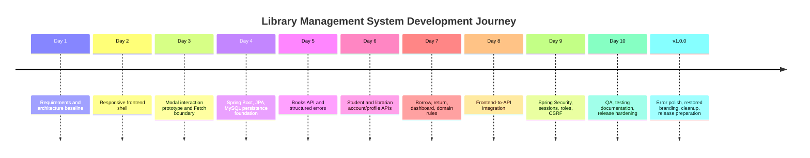

| Phase | Engineering outcome | Evidence retained in the repository |
| --- | --- | --- |
| **Day 1 — Planning** | Frozen scope, eight-table baseline, API contract, ADR-oriented architecture | `ARCHITECTURE.md`, `REQUIREMENTS.md`, ER diagram |
| **Day 2 — UI shell** | Responsive navigation and approved pages: login, dashboard, books, students, librarians, borrow records, profile | `static/index.html`, CSS layers |
| **Day 3 — Interaction boundary** | Reusable modal forms, client validation, toasts, shared Fetch helper | `components/modal.js`, `js/api/http.js` |
| **Day 4 — Persistence** | Spring Boot application, JPA entities, repositories, MySQL configuration, seed admin | entities, repositories, application properties |
| **Day 5 — Books** | CRUD, search, validation/error shape, borrow-history deletion guard | `BookService`, `BookController` |
| **Day 6 — People** | Transactional student/librarian account and profile creation | student/librarian services and DTOs |
| **Day 7 — Circulation** | Borrow/return transactions, availability changes, snapshots, dashboard counts | `BorrowRecordService`, `DashboardService` |
| **Day 8 — Integration** | Demo data replaced by Fetch API calls and UI refresh logic | `main.js`, resource API modules |
| **Day 9 — Security** | Session login/logout, roles, BCrypt, CSRF token forwarding | security package and `AuthService` |
| **Day 10 — Quality** | Test matrix, automated tests, documentation and release checks | tests, `TESTING.md`, screenshots |

---

# 3. Engineering Decision Log

## ADR-01 — Layered REST Architecture

| Element | Record |
| --- | --- |
| **Problem** | Browser logic and persistence concerns must not be mixed in controllers. |
| **Decision** | Use Browser → Fetch → Controller → Service → Repository → MySQL. |
| **Benefits** | Clear responsibilities, testable business rules, contained transactions, easier API evolution. |
| **Rejected direction** | Direct controller-to-repository CRUD. It would weaken business-rule ownership and error consistency. |

## ADR-02 — DTOs Instead of Entity Exposure

| Element | Record |
| --- | --- |
| **Problem** | JPA entities contain persistence relationships and security-sensitive fields such as password hashes. |
| **Decision** | Use request and response DTOs at every REST boundary. |
| **Benefits** | Stable contracts, no accidental password/hash exposure, focused validation, frontend independence. |

## ADR-03 — Accounts with Role-Specific Profiles

| Element | Record |
| --- | --- |
| **Problem** | Students and librarians have different profile data but share authentication needs. |
| **Decision** | Store identity/role in `accounts`; link student and librarian data through one-to-one profile tables. |
| **Benefits** | Normalized data, single authentication model, extensible roles, no duplicated password fields. |

## ADR-04 — Durable Borrow Records with Snapshots

| Element | Record |
| --- | --- |
| **Problem** | A loan must remain historically meaningful even if a profile later changes. |
| **Decision** | Use book/student foreign keys plus borrower name, email, and phone snapshots in `borrow_records`. |
| **Benefits** | Referential integrity plus audit-friendly historical context. |

## ADR-05 — Session Authentication Rather Than JWT

| Element | Record |
| --- | --- |
| **Context** | v1.0.0 is a same-origin, single web application—not a public multi-client API. |
| **Decision** | Spring Security session authentication, `JSESSIONID`, BCrypt, and CSRF protection. |
| **Why not JWT now?** | JWT would add token lifecycle, storage, and revocation complexity without solving a current release requirement. |

## ADR-06 — Cookie CSRF Token for Fetch

| Element | Record |
| --- | --- |
| **Decision** | `CookieCsrfTokenRepository` issues `XSRF-TOKEN`; Fetch includes it as `X-XSRF-TOKEN` for unsafe requests. |
| **Benefit** | State-changing requests remain protected while the browser client can participate safely. |
| **Hardening** | A SPA-aware CSRF request handler supports Spring Security’s XOR protection and the raw JavaScript cookie/header exchange. |

## ADR-07 — Database and Service-Level ISBN Protection

| Element | Record |
| --- | --- |
| **Problem** | A database unique constraint alone initially surfaced as an unhelpful server error. |
| **Decision** | Keep the unique database constraint and check/service-map duplicates to `409 Conflict`. |
| **Benefit** | Data integrity remains database-backed; users receive `ISBN already exists.` instead of a generic 500 response. |

---

# 4. Problems Encountered and Resolutions

| Area | Problem | Root cause | Resolution | Evidence |
| --- | --- | --- | --- | --- |
| CSRF login | Login was rejected before authentication | Spring Security expected masked/XOR request tokens while Fetch sent the raw cookie token | Added `SpaCsrfTokenRequestHandler` to resolve the SPA header safely and force CSRF cookie issuance | Browser-equivalent MockMvc test |
| Duplicate ISBN | Duplicate book creation produced HTTP 500 | Database uniqueness exception was not converted to a domain conflict | Added ISBN pre-checks and `DataIntegrityViolationException` mapping in the book service | `409`, `CONFLICT`, `ISBN already exists.` test |
| Validation feedback | Invalid email surfaced only as a generic validation summary | Backend field errors were available but the modal did not render them | Added explicit email messages and mapped `fieldErrors` to form fields | Invalid-email test and modal feedback |
| Authorization response shape | Default framework failures were inconsistent with API errors | Default Security responses do not use the application error DTO | Added REST authentication-entry-point and access-denied handlers | MockMvc 401/403 assertions |
| Responsive layout | Full desktop navigation/table layout cannot fit narrow screens | Fixed-width desktop assumptions | Added responsive breakpoint CSS, collapsible navigation, and stacked dashboard cards | Mobile screenshot evidence |
| Branding regression | Current mark had degraded to a hollow rectangle | Original visual asset was not reusable in production files | Reintroduced an indigo/teal gradient open-book SVG for nav, login, and favicon | `library-mark.svg` |

> [!WARNING]
> The CSRF incident is an example of why a security test using only Spring Security’s `.with(csrf())` helper is insufficient for an SPA. The dedicated browser-flow test exchanges the actual cookie/header pair used by the client.

---

# 5. Software Architecture

## 5.1 Runtime Architecture

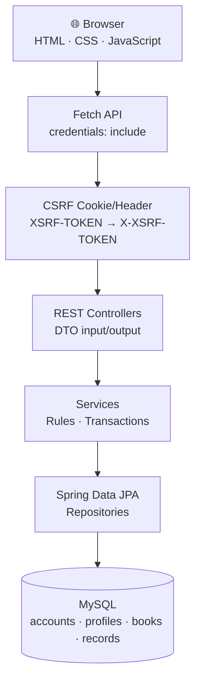

## 5.2 Package Responsibilities

| Package | Responsibility |
| --- | --- |
| `controller` | Maps `/api/**` HTTP requests to DTO-aware application operations. |
| `service` | Owns business rules, transaction boundaries, availability transitions, and authentication orchestration. |
| `repository` | Encapsulates Spring Data JPA persistence queries. |
| `entity` | Defines the normalized persistent domain model and audit fields. |
| `dto` | Defines request validation and safe response contracts. |
| `security` | Configures authentication, session policy, CSRF behavior, and JSON security errors. |
| `exception` | Converts expected domain and validation failures into structured API responses. |
| `static` | Holds the production MPA frontend, CSS system, shared modal, SVG brand asset, and Fetch clients. |

## 5.3 Request Lifecycle

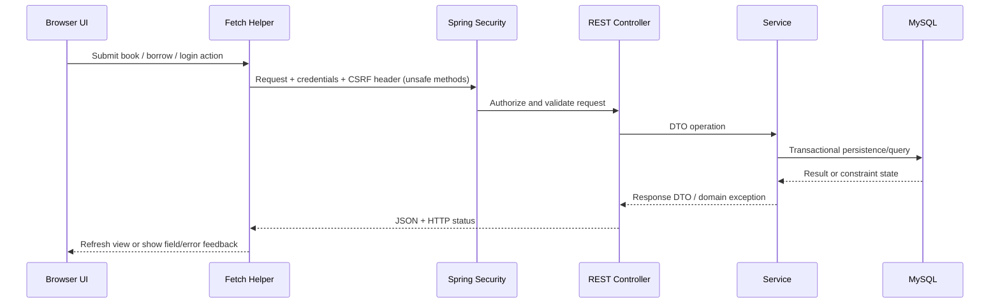

---

# 6. Database Design

## 6.1 Core Model

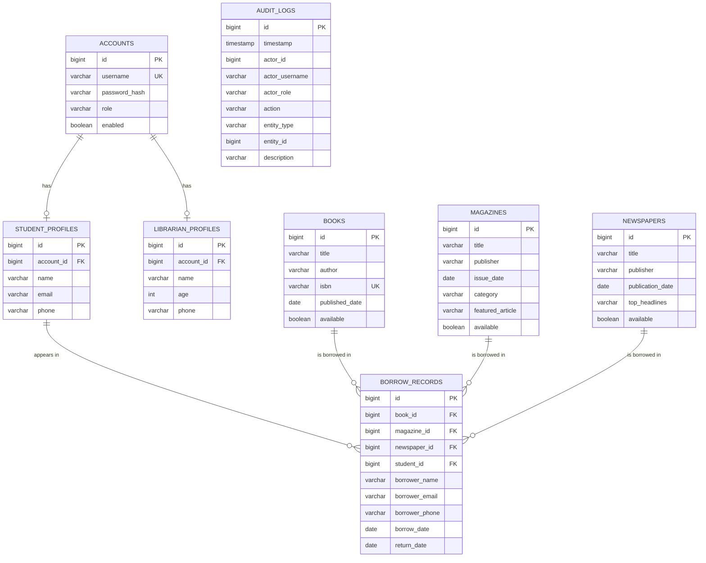

## 6.2 Data Rules

- `accounts.username` is unique; passwords are stored as BCrypt hashes, never plaintext.
- `student_profiles.account_id` and `librarian_profiles.account_id` are unique one-to-one links.
- `books.isbn` is unique when supplied; `null` ISBN values remain permitted.
- `books.available` is the current circulation state. Borrow sets it false; return restores it true.
- A borrow record keeps book/student links and borrower snapshots for historical context.
- All entities inherit created/updated auditing timestamps through `AuditableEntity`.

---

# 7. Feature Implementation

## 7.1 Authentication, Session, and Profile

**Purpose.** Establish a safe browser session and expose only non-sensitive current-user data.

**Implementation.** `AuthController` delegates to `AuthService`, which authenticates through the configured `AuthenticationManager`, creates a Spring Security context, and stores it in the HTTP session. `/api/auth/me` and `/api/profile` return safe response DTOs.

**Security and validation.** Password hashes remain internal. Login is public but CSRF-protected; protected endpoints return JSON `401` or `403` responses.

```json
POST /api/auth/login
{"username":"admin","password":"ChangeMe123!"}

200 OK
{"accountId":1,"username":"admin","role":"ADMIN","displayName":"admin"}
```

## 7.2 Books

**Purpose.** Provide the searchable catalogue and authoritative book availability state.

**Implementation.** `BookController` exposes list, get, create, update, and delete endpoints; `BookService` enforces ISBN uniqueness and blocks deletion for books with borrow history.

**Validation.** Title is required; duplicate ISBN produces a structured conflict instead of a generic database error.

```json
409 Conflict
{"code":"CONFLICT","message":"ISBN already exists.","fieldErrors":[]}
```

## 7.3 Students and Librarians

**Purpose.** Separate people-management responsibilities from authentication identities.

**Implementation.** Student and librarian services atomically create `Account` plus profile records. Ordinary profile updates do not infer password reset behavior.

**Validation and security.** Email uses a clear `Invalid email address.` message. Librarian management is administrator-only at the API boundary.

## 7.4 Borrow and Return

**Purpose.** Make circulation transitions durable and safe.

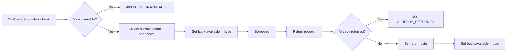

**Testing.** The integration suite validates successful borrow, duplicate borrow rejection, successful return, repeated-return rejection, and book deletion conflict after history exists.

## 7.5 Dashboard and Responsive Frontend

**Purpose.** Give staff a concise operational view while keeping the interface usable on both desktop and mobile.

**Implementation.** The dashboard API provides five totals. The static MPA frontend uses centralized API modules, a shared `requestJson()` helper, reusable modals, responsive CSS breakpoints, and a compact mobile navigation mode.

---

# 8. Black-Box and Automated Testing

> [!NOTE]
> The automated suite runs against H2 in MySQL compatibility mode. The repository’s black-box CSV remains the local-MySQL/manual checklist; its pending labels are intentionally preserved where full manual evidence has not been recorded.

| Test ID | Feature | Input / action | Expected result | Evidence / actual result | Status |
| --- | --- | --- | --- | --- | --- |
| AT-01 | Login | Valid admin credentials | 200 and authenticated session | Browser-flow MockMvc test | ✅ Automated |
| AT-02 | Logout | Authenticated session + CSRF header | 204; later `/me` is 401 | Browser-flow MockMvc test | ✅ Automated |
| AT-03 | CSRF | Cookie from `/auth/csrf` sent as `X-XSRF-TOKEN` | Login reaches authentication | Raw cookie/header exchange tested | ✅ Automated |
| AT-04 | Unauthorized | GET protected books without session | Structured 401 JSON | `UNAUTHORIZED` asserted | ✅ Automated |
| AT-05 | Role restriction | Librarian accesses librarian management | Structured 403 JSON | `FORBIDDEN` asserted | ✅ Automated |
| AT-06 | Books CRUD | Create/search book | 201 then matching result | Full integration flow | ✅ Automated |
| AT-07 | Required book field | Missing title | 400 field errors | Validation assertion | ✅ Automated |
| AT-08 | Duplicate ISBN | Create same ISBN twice | 409 and clear message | Conflict/message assertion | ✅ Automated |
| AT-09 | Students CRUD | Create student profile/account | 201, student role | Full integration flow | ✅ Automated |
| AT-10 | Invalid email | Student email `not-an-email` | 400, email field message | `Invalid email address.` asserted | ✅ Automated |
| AT-11 | Librarians CRUD | Create librarian | 201, librarian role | Full integration flow | ✅ Automated |
| AT-12 | Borrow | Borrow available book | 201, `BORROWED`, unavailable book | Full integration flow | ✅ Automated |
| AT-13 | Duplicate borrow | Borrow same unavailable book | 400 `BOOK_UNAVAILABLE` | Assertion present | ✅ Automated |
| AT-14 | Return | Return active record | 204, book restored | Assertion present | ✅ Automated |
| AT-15 | Repeated return | Return same record twice | 400 `ALREADY_RETURNED` | Assertion present | ✅ Automated |
| AT-16 | Audit/constraint | Persist duplicate ISBN | Database rejects duplicate; timestamps populated | Repository test | ✅ Automated |
| BB-01…14 | Browser/local MySQL matrix | API/UI scenarios in CSV | Match documented statuses | Checklist retained for manual execution | 🟡 Manual evidence tracked |
| UI-01 | Responsive design | Narrow viewport navigation/cards | Accessible compact layout | Mobile screenshot set | 📸 Visual evidence |

### Test Execution Command

```bash
./mvnw clean test
```

The v1.0.0 release preparation record reports a successful suite with **6 tests** across integration, browser-CSRF, and repository classes.

---

# 9. Test Evidence and Screenshots

> [!TIP]
> These images are retained as review evidence. They demonstrate the evolving user interface, validation states, and mobile layout; automated tests remain the authoritative executable verification for API behavior.

## 9.1 Desktop Evidence

| Area | Evidence |
| --- | --- |
| Authentication |  |
| Dashboard |  |
| Books |  |
| Add/book saved | 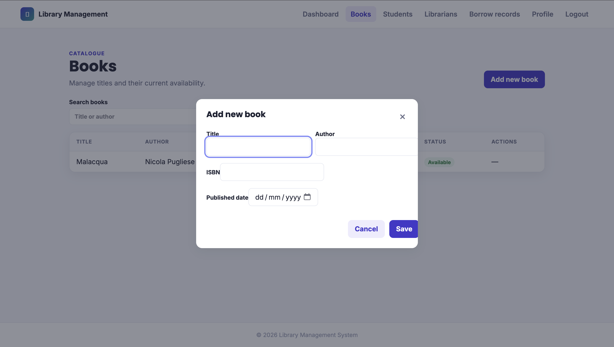 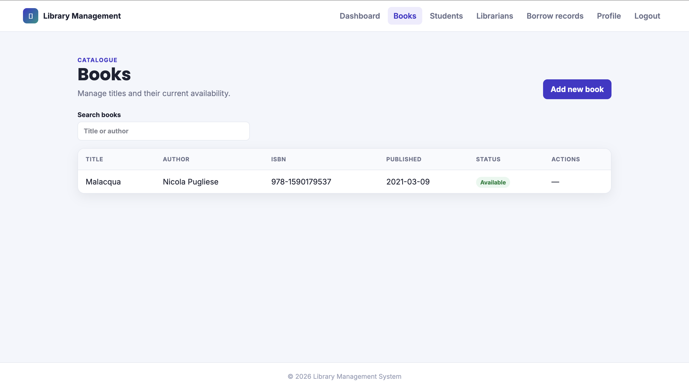 |
| Students |  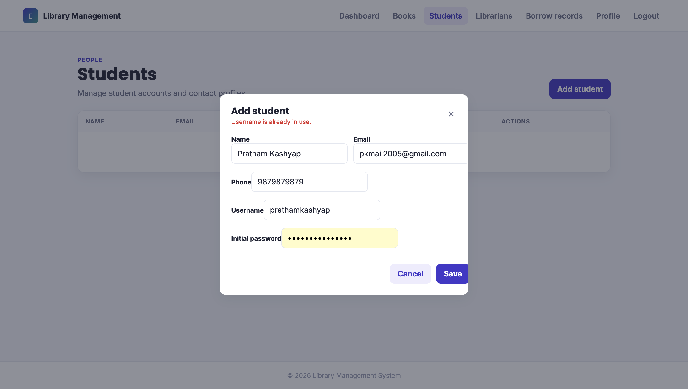 |
| Librarians |  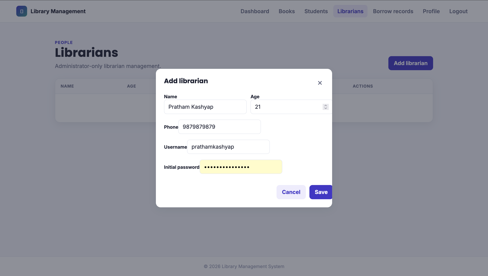 |
| Borrow records |  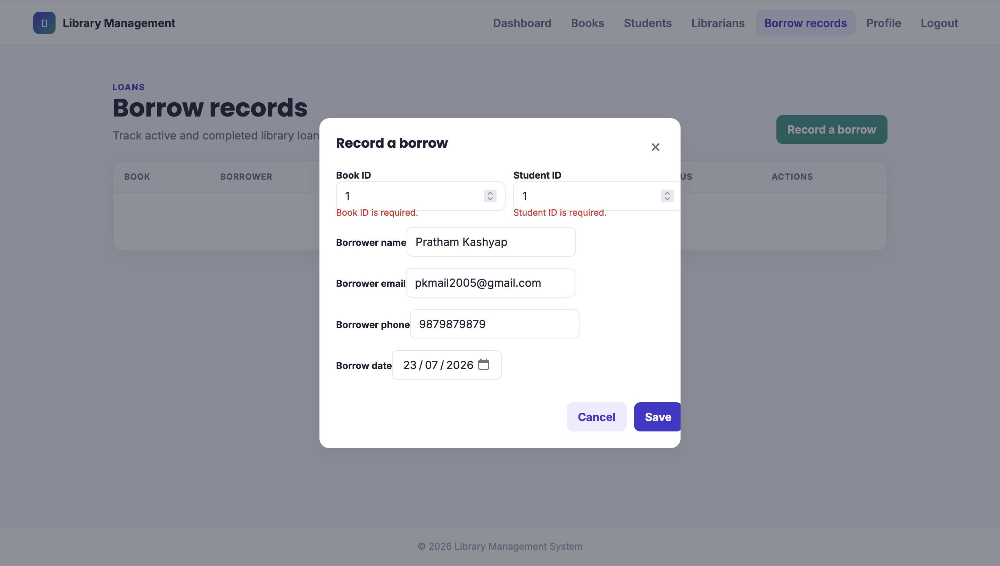 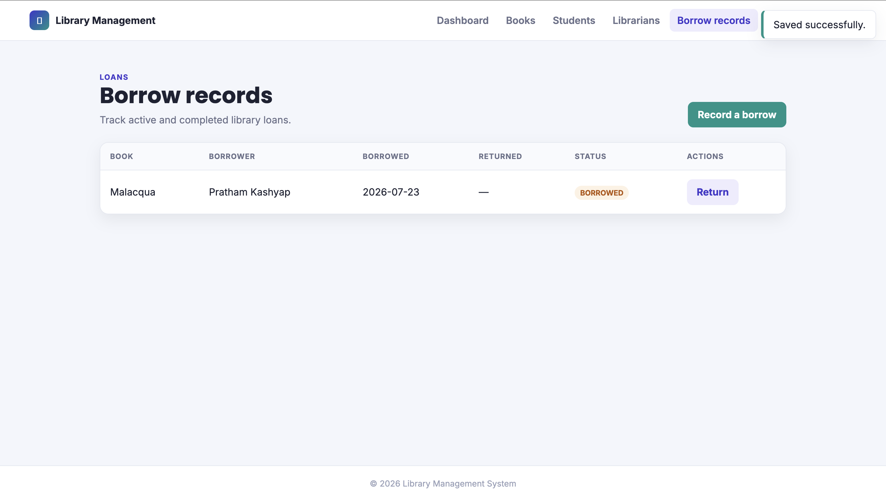 |
| Profile and logout | 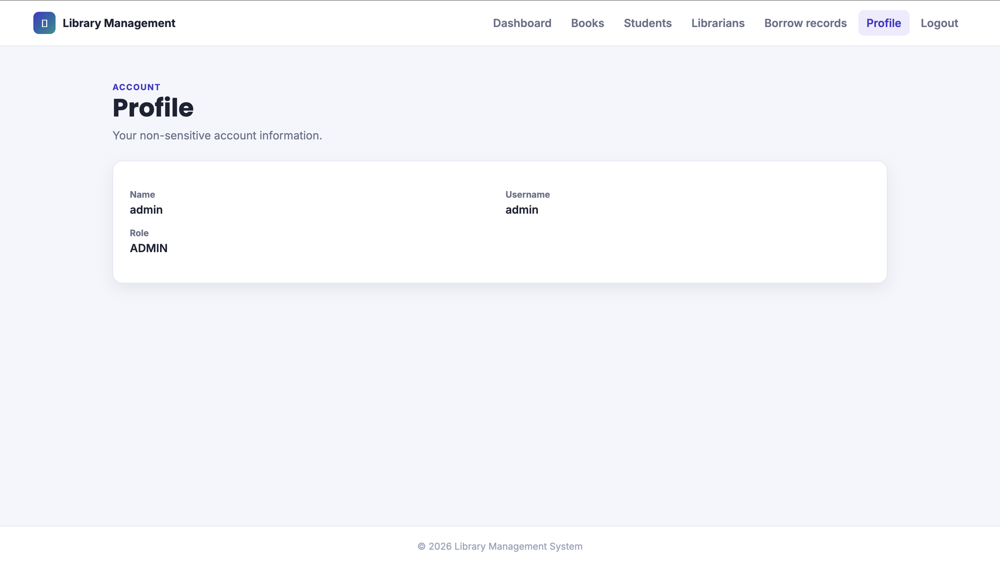 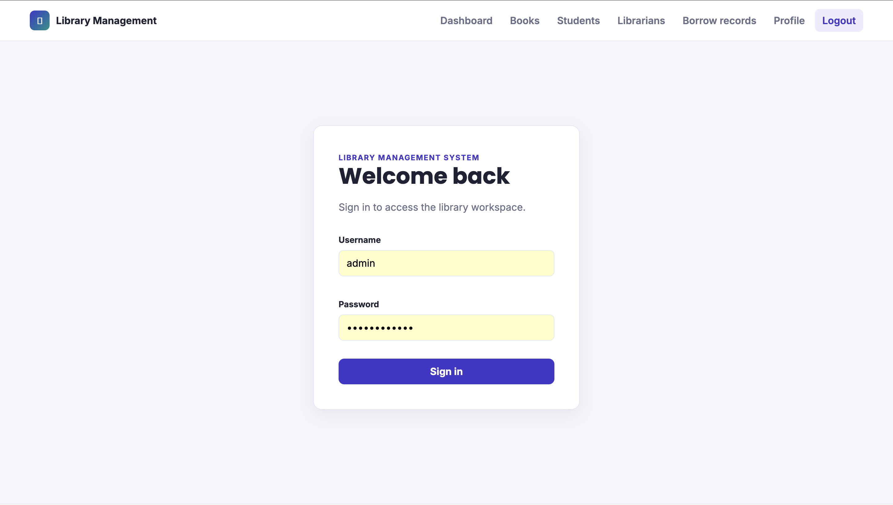 |
| Validation/conflict evidence |   |

## 9.2 Mobile Evidence

| Area | Evidence |
| --- | --- |
| Authentication/navigation |  |
| Dashboard |  |
| Duplicate ISBN state |  |
| Validation states |  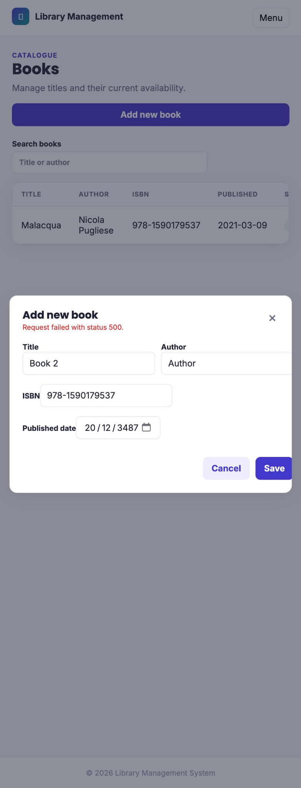 |
| Borrow/return | 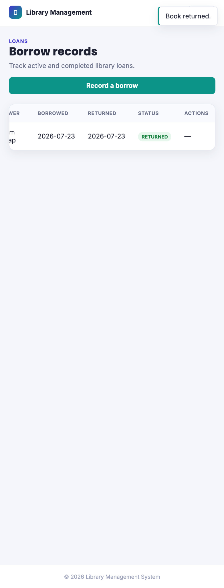 |

> [!WARNING]
> The release checklist still requests regenerated desktop evidence for the final duplicate-ISBN, invalid-email, and return-book states. This report does not misrepresent those missing final captures as completed.

---

# 10. Code Quality and Engineering Practices

| Practice | Applied approach |
| --- | --- |
| Layering | Controllers adapt HTTP; services own rules/transactions; repositories own persistence access. |
| DTO discipline | API uses request/response records rather than serializing JPA entities. |
| Exception handling | Global advice returns structured errors for validation, not-found, conflict, and business rules. |
| Validation | Jakarta Bean Validation guards request fields; frontend maps returned errors to relevant inputs. |
| Persistence quality | Lazy relationships, audited entities, unique username/ISBN constraints, transactions. |
| Security | DAO authentication, BCrypt, sessions, CSRF, role rules, REST 401/403 responses. |
| Frontend boundary | Central Fetch helper handles cookies, CSRF headers, JSON/error/204 behavior. |
| Documentation | Architecture, API, setup, testing, release notes, screenshots, and this report are separated by purpose. |

---

# 11. Lessons Learned

1. **Spring Security is a request pipeline, not merely a login check.** CSRF rejection occurs before the authentication service; meaningful debugging required tracing the complete browser cookie/header path.
2. **Database constraints and user-facing errors have different jobs.** The ISBN constraint protects integrity; a service-level conflict response protects usability.
3. **DTOs make a small project safer, not unnecessarily complex.** They prevented accidental entity/password exposure and kept API responses stable.
4. **Integration tests need realistic boundaries.** A synthetic CSRF helper was useful but could not detect the actual SPA token mismatch.
5. **Frontend integration is contract work.** Centralized Fetch code and structured `fieldErrors` reduced repeated parsing logic and made validation feedback consistent.
6. **Documentation is an engineering artifact.** The changelog, API contract, architecture decisions, test matrix, and release report make design intent reviewable after implementation.
7. **Release engineering includes hygiene.** Wrapper-based test execution, generated-file exclusions, asset organization, and cleanup are part of delivering a usable repository.

---

# 12. Future Improvements

The following are intentionally outside v1.0.0:

- Richer search filters and book categories.
- Reservations, notifications, fines, overdue automation, and analytics.
- Physical-copy modelling for multiple copies of one title/ISBN.
- Advanced reporting and operational dashboards.
- JWT or other API-client authentication only if the project expands beyond its same-origin web application model.

The following were originally deferred but are **implemented in v1.0.0**:

- Basic page/size pagination on list endpoints.
- Swagger/OpenAPI documentation (springdoc).
- Docker Compose with MySQL, backend, and phpMyAdmin.
- CI via GitHub Actions.

---

# 13. Release Summary

## v1.0.0 Deliverables

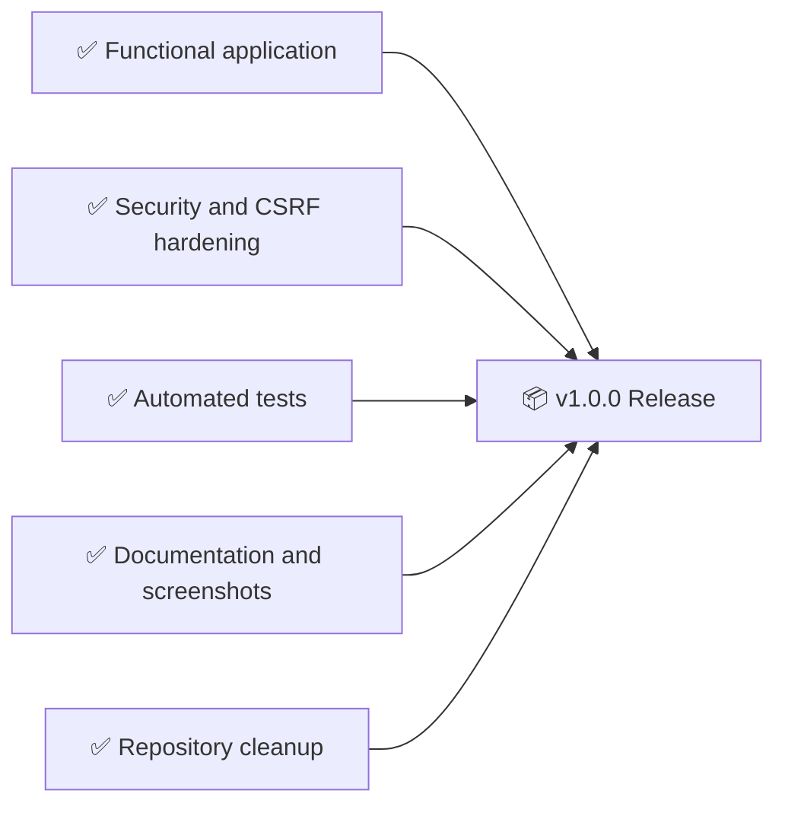

| Deliverable | v1.0.0 state |
| --- | --- |
| Spring Boot backend | Complete |
| Session authentication and role authorization | Complete |
| Books, students, librarians, borrow/return workflows | Complete |
| Responsive static frontend | Complete |
| Duplicate ISBN and field-level email feedback | Complete |
| MockMvc, browser-CSRF, and repository tests | Complete |
| API, architecture, setup, testing, release documentation | Complete |
| Repository cleanup and root Maven wrapper | Complete |

> [!SUCCESS]
> v1.0.0 represents a coherent baseline: a working full-stack library workflow, an explicit architecture, controlled error handling, executable tests, responsive UI evidence, and documentation suitable for academic evaluation or technical review.

---

## Related Documentation

- [Architecture and ADR record](ARCHITECTURE.md)
- [API contract](API.md)
- [Requirements traceability](REQUIREMENTS.md)
- [Local setup](SETUP.md)
- [Testing guide](TESTING.md)
- [Changelog](CHANGELOG.md)
- [Project structure](PROJECT_STRUCTURE.md)
