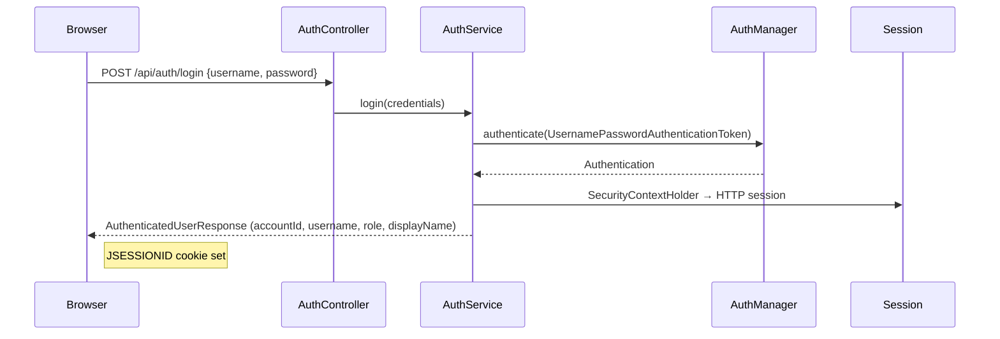
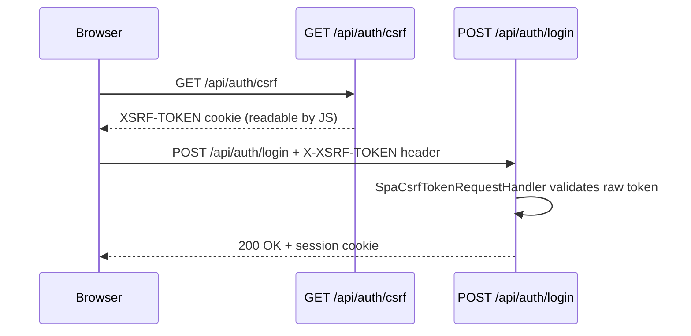

# Security

The Library Management System uses **session-based authentication** with Spring Security 6.5, **BCrypt password hashing**, **CSRF protection** via a SPA-aware token handler, and **URL-pattern-based role authorization**. The frontend and API share the same origin (Spring Boot serves both), so no CORS configuration is needed.

See [ARCHITECTURE.md](ARCHITECTURE.md) for system context and [API.md](API.md) for endpoint reference.

---

## Authentication

### Mechanism

| Aspect | Implementation |
|--------|----------------|
| Password hashing | `BCryptPasswordEncoder` via `PasswordConfig` |
| User lookup | `AccountUserDetailsService` implements `UserDetailsService`; maps `Account` → Spring Security `User` with `ROLE_` prefix |
| Authentication provider | `DaoAuthenticationProvider` wired with the UserDetailsService and BCrypt encoder |
| Login endpoint | `POST /api/auth/login` → `AuthService.login()` → `AuthenticationManager.authenticate()` → creates `SecurityContext` and stores in HTTP session |
| OAuth2 login | Google OAuth2 client configured via `oauth2Login()` with `defaultSuccessUrl("/")`. Client ID/secret from `GOOGLE_CLIENT_ID` and `GOOGLE_CLIENT_SECRET` env vars. |
| Session management | `SessionCreationPolicy.IF_REQUIRED` — sessions are created on login, not eagerly |

### Login flow



### Logout flow

1. `POST /api/auth/logout` with `X-XSRF-TOKEN` header.
2. `AuthService.logout()` invalidates the HTTP session and clears `SecurityContextHolder`.
3. Frontend nulls `currentUser` and redirects to login.

### Session properties

| Property | Value |
|----------|-------|
| Creation policy | `IF_REQUIRED` (created on login) |
| Cookie | `HttpOnly`, SameSite follows framework/container defaults (not explicitly configured) |
| Frontend usage | `credentials: 'include'` on all Fetch requests |

---

## Authorization

### Role model

The system defines three roles via the `Role` enum:

| Role | Capabilities |
|------|-------------|
| **ADMIN** | Full access. Creates/manages librarian accounts. Manages books, students, borrow records, dashboard. Only role seeded at startup. |
| **LIBRARIAN** | Manages books, students, and borrow records. Views dashboard. Cannot manage librarian accounts. |
| **STUDENT** | Views books (GET) and own profile. Cannot manage any records or access dashboard. |

### URL-pattern authorization

Authorization is enforced at the URL-pattern level in `SecurityConfig.security()`. Rules are evaluated in declaration order:

```java
// Public endpoints
.requestMatchers("/swagger-ui/**", "/v3/api-docs/**", "/login.html", "/styles.css",
    "/css/**", "/js/**", "/components/**", "/assets/**",
    "/api/auth/login", "/api/auth/csrf", "/login.html", "/register.html").permitAll()

// Authenticated endpoints
.requestMatchers("/api/auth/logout", "/api/auth/me", "/api/profile").authenticated()

// Student dashboard — STUDENT, ADMIN, LIBRARIAN
.requestMatchers("/api/student/**").hasAnyRole("ADMIN", "LIBRARIAN", "STUDENT")

// Books, magazines, newspapers GET — any authenticated user (including STUDENT)
.requestMatchers(HttpMethod.GET, "/api/books/**", "/api/magazines/**", "/api/newspapers/**").authenticated()

// Librarians — ADMIN only
.requestMatchers("/api/librarians/**").hasRole("ADMIN")

// Analytics, audit, reports — ADMIN and LIBRARIAN
.requestMatchers("/api/analytics/**", "/api/audit/**", "/api/reports/**").hasAnyRole("ADMIN", "LIBRARIAN")

// Books mutate, students, borrow records mutate, dashboard — ADMIN and LIBRARIAN
.requestMatchers("/api/books/**", "/api/students/**", "/api/borrow-records/**", "/api/dashboard").hasAnyRole("ADMIN", "LIBRARIAN")

// Librarian dashboard — ADMIN and LIBRARIAN
.requestMatchers("/api/librarian/dashboard").hasAnyRole("ADMIN", "LIBRARIAN")

// Everything else — authenticated
.anyRequest().authenticated()
```

### Authorization matrix

| Resource | Method | ADMIN | LIBRARIAN | STUDENT | Unauthenticated |
|----------|--------|:-----:|:---------:|:-------:|:---------------:|
| `/api/auth/csrf` | GET | ✅ | ✅ | ✅ | ✅ |
| `/api/auth/login` | POST | ✅ | ✅ | ✅ | ✅ |
| `/api/auth/me` | GET | ✅ | ✅ | ✅ | ❌ (401) |
| `/api/auth/logout` | POST | ✅ | ✅ | ✅ | ❌ (401) |
| `/api/books` | GET | ✅ | ✅ | ✅ | ❌ (401) |
| `/api/books` | POST | ✅ | ✅ | ❌ (403) | ❌ (401) |
| `/api/books/{id}` | PUT | ✅ | ✅ | ❌ (403) | ❌ (401) |
| `/api/books/{id}` | DELETE | ✅ | ✅ | ❌ (403) | ❌ (401) |
| `/api/magazines` | GET | ✅ | ✅ | ✅ | ❌ (401) |
| `/api/magazines` | POST | ✅ | ✅ | ❌ (403) | ❌ (401) |
| `/api/magazines/{id}` | PUT | ✅ | ✅ | ❌ (403) | ❌ (401) |
| `/api/magazines/{id}` | DELETE | ✅ | ✅ | ❌ (403) | ❌ (401) |
| `/api/newspapers` | GET | ✅ | ✅ | ✅ | ❌ (401) |
| `/api/newspapers` | POST | ✅ | ✅ | ❌ (403) | ❌ (401) |
| `/api/newspapers/{id}` | PUT | ✅ | ✅ | ❌ (403) | ❌ (401) |
| `/api/newspapers/{id}` | DELETE | ✅ | ✅ | ❌ (403) | ❌ (401) |
| `/api/students` | * | ✅ | ✅ | ❌ (403) | ❌ (401) |
| `/api/librarians` | * | ✅ | ❌ (403) | ❌ (403) | ❌ (401) |
| `/api/borrow-records` | GET | ✅ | ✅ | ❌ (403) | ❌ (401) |
| `/api/borrow-records/my` | GET | ✅ | ✅ | ✅ | ❌ (401) |
| `/api/borrow-records` | POST | ✅ | ✅ | ❌ (403) | ❌ (401) |
| `/api/borrow-records/{id}/return` | POST | ✅ | ✅ | ❌ (403) | ❌ (401) |
| `/api/dashboard` | GET | ✅ | ✅ | ❌ (403) | ❌ (401) |
| `/api/student/dashboard` | GET | ✅ | ✅ | ✅ | ❌ (401) |
| `/api/librarian/dashboard` | GET | ✅ | ✅ | ❌ (403) | ❌ (401) |
| `/api/analytics/*` | * | ✅ | ✅ | ❌ (403) | ❌ (401) |
| `/api/audit/*` | * | ✅ | ❌ (403) | ❌ (403) | ❌ (401) |
| `/api/reports/*` | * | ✅ | ✅ | ❌ (403) | ❌ (401) |
| `/api/profile` | GET | ✅ | ✅ | ✅ | ❌ (401) |

**Rule ordering note:** The rule `requestMatchers(HttpMethod.GET, "/api/books/**").authenticated()` appears before `requestMatchers("/api/books/**").hasAnyRole("ADMIN","LIBRARIAN")`. This means GET requests from any authenticated user (including STUDENT) are permitted, while POST/PUT/DELETE require ADMIN or LIBRARIAN.

### No method-level security

No `@PreAuthorize`, `@Secured`, or `@RolesAllowed` annotations are used anywhere in the codebase. Authorization is purely URL-pattern-based.

---

## CSRF Protection

### Implementation

| Aspect | Implementation |
|--------|----------------|
| Token repository | `CookieCsrfTokenRepository.withHttpOnlyFalse()` — makes `XSRF-TOKEN` cookie readable by JavaScript |
| SPA handler | `SpaCsrfTokenRequestHandler` — accepts raw (non-XOR-encoded) token from `X-XSRF-TOKEN` header for SPA requests, while retaining XOR protection for traditional form submissions |
| Frontend usage | `http.js` reads `XSRF-TOKEN` cookie, attaches `X-XSRF-TOKEN` header on non-GET requests |
| Bootstrap | `GET /api/auth/csrf` triggers cookie generation; called on page load |

### CSRF flow



### Why CSRF is not disabled

Session cookies are automatically included by the browser on same-origin requests. Without CSRF protection, a malicious site could submit state-changing requests (borrow, delete, create) on behalf of an authenticated user. The `SpaCsrfTokenRequestHandler` provides SPA-compatible CSRF protection without disabling it.

---

## Security Handlers

| Scenario | Handler | HTTP Status | JSON Code |
|----------|---------|-------------|-----------|
| No session / invalid credentials | `RestAuthenticationEntryPoint` | 401 | `UNAUTHORIZED` |
| Insufficient role | `RestAccessDeniedHandler` | 403 | `FORBIDDEN` |

Both return the standard `ApiErrorResponse` JSON shape — no HTML error pages, no stack traces.

---

## Password Storage

- Passwords are processed using `BCryptPasswordEncoder`.
- A new password is encoded before the account is saved.
- Login uses BCrypt's verification method.
- The database stores the resulting hash only.
- `server.error.include-message=never` prevents Spring Boot from leaking error details.

---

## Admin Seed

A `CommandLineRunner` in `AdminSeeder` creates an `admin` account with `ROLE_ADMIN` if no `admin` username exists. Reads `lms.admin.username` and `lms.admin.password` from configuration. Throws `IllegalStateException` if the password is null or blank.

**Warning:** The default password is a development seed. Change it before any non-local deployment.

---

## Security Properties

```properties
# Prevent Spring Boot from leaking error details
server.error.include-message=never

# Null fields omitted from JSON responses
spring.jackson.default-property-inclusion=non_null
```

---

## Known Security Gaps

| Gap | Impact | Mitigation |
|-----|--------|------------|
| No password reset/change | Users cannot change their password | Defer to future scope |
| No rate limiting | Brute-force login attempts possible | Defer to future scope |
| No account lockout | Repeated failed logins not throttled | Defer to future scope |
| No CORS configuration | Not needed for same-origin deployment | Add if separate frontend server is used |
| Profile deletion may orphan accounts | No `CascadeType` or `orphanRemoval` on `@OneToOne` | Documented gap; add cascade policy if needed |
| `ddl-auto=update` in production | Schema changes applied without migration versioning | Adopt Flyway/Liquibase for production |
